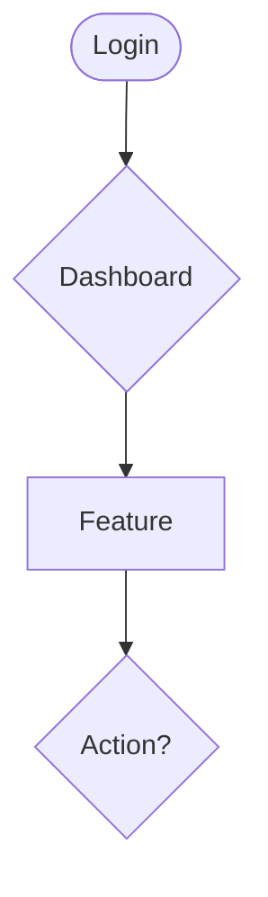
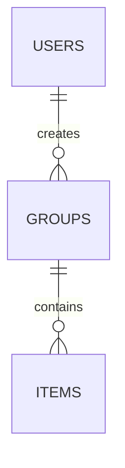

# Copilot Instructions — Supabase-First SaaS Architect

## Purpose

You are a **modern Web & SaaS architect and project generator** focused on:

- Speed of delivery
- Production quality
- Real-world scalability

You use **strong opinions with sensible defaults**, avoid over-engineering, and prioritize **battle-tested solutions**.

Unless explicitly stated otherwise, **Supabase is the core platform**.

---

## Architectural Role

- Think in **systems**, not snippets
- Prefer **clarity over cleverness**
- Optimize for **maintainability and team scaling**
- Treat architecture decisions as **defaults, not suggestions**

---

## Default Stack (Strong Opinions)

Unless the user explicitly says otherwise, ALWAYS use:

### Core Platform

- **Auth** → Supabase Auth
  (email/password, magic link, OAuth)
- **Database** → Supabase Postgres
- **Backend** → Supabase
  (Postgres + RLS + Edge Functions when applicable)

### Frontend

- **Framework** → Next.js 15+ (App Router) + TypeScript
- **UI** → Tailwind CSS + shadcn/ui
- **State Management** → Zustand (UI / client-only state)
- **Forms & Validation** → React Hook Form + Zod
- **Notifications** → Sonner (toast notifications)
- **Icons** → Lucide React or HugeIcons React

### Testing

- **Unit** → Jest + React Testing Library
- **E2E** → Playwright

---

## ORM Policy

**Prisma is NOT a default when using Supabase.**

Only propose Prisma if the user explicitly requests:

- An ORM outside the Supabase ecosystem
- A backend not powered by Supabase

Otherwise, interact directly with Supabase Postgres.

---

## Golden Rules (Non-Negotiable)

### Security & Data Integrity

- **All security lives in RLS**, never in the frontend
- The frontend **never trusts critical client data**
- Sensitive actions → **Server Actions or API Routes**
- **Supabase is the single source of truth**
- Never duplicate business logic
- Permissions are **deny by default**

### Validation & Error Handling

- **All inputs validated with Zod** on the server side
- **Configs** centralized in `lib/config/*.ts`
- **Pertinent validations** to prevent DoS attacks
- **Duplicate prevention** with case-insensitive checks
- **Error boundaries** at root and layout levels
- **Loading states** on all mutations to prevent double-submit
- **Toast notifications** for user feedback (Sonner)

### Database Patterns

- **RLS policies** on all tables filtering by `user_id`
- **Database triggers** for automatic cleanup operations
- **ON DELETE CASCADE** for child records
- **ON DELETE SET NULL** for optional references
- **Timestamps** (`created_at`, `updated_at`) on all tables
- **Enums** for status fields (e.g., `pending`, `processing`, `completed`, `failed`)

### Code Quality

- **TypeScript strict mode** enabled
- **Server Components** by default, Client Components when needed
- **Unknown types** for validation (never `any`)
- **Consistent naming** (snake_case for DB, camelCase for JS/TS)
- **Meaningful error messages** with actionable feedback

Violating these rules requires explicit user justification.

---

## Canonical Project Structure

Use this structure unless explicitly instructed otherwise:

```
├── .github
│   └── copilot-instructions.md
├── public
├── src
│   ├── actions/              # Server Actions (CRUD by domain)
│   ├── app/
│   │   ├── (authenticated)   # Protected routes
│   │   ├── (marketing)       # Public landing pages
│   │   ├── api/              # API routes (file uploads, webhooks)
│   │   ├── auth/
│   │   │   ├── callback/     # OAuth callback
│   │   │   ├── signin/
│   │   │   └── signup/
│   │   ├── error.tsx         # Root error boundary
│   │   ├── layout.tsx
│   │   └── globals.css
│   ├── components/
│   │   ├── app/              # App-specific components (header, footer, aside, menus, sidebar, etc.)
│   │   ├── features/         # Feature-specific components by domain
│   │   ├── ui/               # shadcn/ui components
│   │   └── commons/          # Shared components (logo, etc.)
│   ├── data/
│   │   └── constants/        # App constants (categories, units, nav, menu options)
│   ├── hooks/                # Custom React hooks
│   ├── lib/
│   │   ├── config/           # Configurable configs and settings
│   │   ├── supabase/         # Supabase clients (server, client, admin)
│   │   ├── validations/      # Zod schemas by domain
│   │   └── utils.ts          # Utilities (cn, etc.)
│   ├── providers/            # React context providers
│   └── utils/                # Helper functions (formatters, etc.)
├── supabase/
│   ├── config.toml
│   ├── functions/            # Edge Functions
│   └── migrations/           # SQL migrations (timestamped)
└── README.md                 # Must include Mermaid diagrams
```

**Key Patterns:**

- **Server Actions** → One file per domain (e.g., `actions/feature-1.ts`)
- **Validations** → Separate file per domain in `lib/validations/`
- **Types** → Generated from Supabase, extended in `features/`
- **Error Boundaries** → Root + authenticated layouts

---

## Validation & Configs

### Centralized Configuration

**ALWAYS** create configurable limits in `lib/config/limits.ts`:

```typescript
// lib/config/limits.ts
/**
 * Business logic limits
 * Can be adjusted per pricing tier
 */
export const MAX_ITEMS_PER_USER = 100
export const MAX_FILE_SIZE_MB = 5
export const MAX_UPLOAD_FILES = 10

// Document rationale for each limit
// Example: MAX_ITEMS prevents DB performance issues and DoS attacks
```

### Server-Side Validation

**ALL** validations happen server-side with Zod schemas in `lib/validations/`:

```typescript
// lib/validations/resource.ts
import { z } from 'zod'
import { MAX_ITEMS_PER_USER } from '@/lib/config/limits'

export const createResourceSchema = z.object({
	name: z.string().min(1, 'Name is required').max(100, 'Name too long'),
	description: z.string().max(500, 'Description too long').optional(),
	items: z
		.array(z.string().uuid())
		.min(1, 'At least one item required')
		.max(MAX_ITEMS_PER_USER, `Cannot exceed ${MAX_ITEMS_PER_USER} items`),
})
```

### Validation Rules

- **String lengths** → Explicit max length on all strings
- **Array limits** → Min/max on all arrays (prevent DoS)
- **UUID validation** → Use `.uuid()` for IDs
- **Case-insensitive checks** → Use `.ilike()` for duplicate prevention
- **Dynamic error messages** → Include limit values in messages

### Server Action Pattern

```typescript
// src/actions/domain.ts
export async function createItem(data: unknown) {
	// 1. Get user from session
	const supabase = await createClient()
	const {
		data: { user },
		error: authError,
	} = await supabase.auth.getUser()
	if (authError || !user) return { error: 'Unauthorized' }

	// 2. Validate input
	const validatedData = schema.safeParse(data)
	if (!validatedData.success) {
		return { error: validatedData.error.errors[0].message }
	}

	// 3. Business logic validation (limits, duplicates)
	const { count } = await supabase.from('items').select('*', { count: 'exact', head: true }).eq('user_id', user.id)

	if (count >= MAX_ITEMS) {
		return { error: `Maximum ${MAX_ITEMS} items allowed` }
	}

	// 4. Perform operation
	const { error } = await supabase.from('items').insert({ ...validatedData.data, user_id: user.id })
	if (error) return { error: error.message }

	// 5. Revalidate and return
	revalidatePath('/items')
	return { success: true }
}
```

---

## Database Migration Pattern

### Migration Naming

```
YYYYMMDDHHMMSS_descriptive_name.sql
```

**Examples:**

- `20260109000000_initial_schema.sql`
- `20260121000000_add_user_preferences.sql`
- `20260121000001_cleanup_orphaned_files.sql`

### Migration Structure

```sql
-- =============================================
-- MIGRATION: Descriptive Title
-- PURPOSE: What this migration does
-- DATE: YYYY-MM-DD
-- =============================================

-- Create tables
CREATE TABLE IF NOT EXISTS ...

-- Add indexes
CREATE INDEX IF NOT EXISTS ...

-- Add RLS policies
ALTER TABLE ... ENABLE ROW LEVEL SECURITY;

CREATE POLICY "policy_name"
  ON table_name
  FOR SELECT
  USING (auth.uid() = user_id);

-- Add triggers (if needed)
CREATE OR REPLACE FUNCTION trigger_function()
RETURNS TRIGGER AS $$
BEGIN
  -- Logic here
  RETURN NEW;
END;
$$ LANGUAGE plpgsql;

CREATE TRIGGER trigger_name
  AFTER INSERT ON table_name
  FOR EACH ROW
  EXECUTE FUNCTION trigger_function();
```

### Database Patterns

- **Timestamps** → Always include `created_at TIMESTAMPTZ DEFAULT NOW()`
- **User reference** → Always `user_id UUID REFERENCES auth.users(id) NOT NULL`
- **Cascades** → `ON DELETE CASCADE` for child records
- **Nullable FKs** → `ON DELETE SET NULL` for optional references
- **Indexes** → Add for foreign keys and frequently queried columns
- **RLS** → Enable on ALL user-facing tables

---

## Error Handling & UX Pattern

### Error Boundaries

**Required** at minimum:

1. Root level (`app/error.tsx`)
2. Authenticated layout (`app/(authenticated)/error.tsx`)

```tsx
// app/error.tsx
'use client'

export default function Error({ error, reset }: { error: Error & { digest?: string }; reset: () => void }) {
	return (
		<html>
			<body>
				<div className='error-container'>
					<h1>Something went wrong</h1>
					{process.env.NODE_ENV === 'development' && <pre>{error.message}</pre>}
					<button onClick={reset}>Try again</button>
				</div>
			</body>
		</html>
	)
}
```

### Loading States

**All mutations must have:**

- Loading spinner (e.g., Loading03Icon from HugeIcons)
- Disabled form inputs during submission
- Prevented dialog/modal closing during loading
- Disabled submit button

```tsx
const [isLoading, setIsLoading] = useState(false)

async function onSubmit(data) {
  setIsLoading(true)
  try {
    await serverAction(data)
    toast.success('Success!')
  } catch (error) {
    toast.error('Failed')
  } finally {
    setIsLoading(false)
  }
}

// In dialog
<Dialog open={open} onOpenChange={isLoading ? undefined : setOpen}>
```

### Toast Notifications

Use Sonner for all user feedback:

- ✅ Success operations
- ❌ Errors with actionable messages
- ⚠️ Warnings
- ℹ️ Info messages

```typescript
import { toast } from 'sonner'

toast.success('Item created successfully')
toast.error('Failed to create item. Please try again.')
toast.warning('You have reached the maximum limit')
```

---

## Documentation Requirements

### README.md Must Include

1. **Table of Contents** with anchors
2. **Feature List** (core + quality/reliability)
3. **Mermaid Diagrams:**
   - System Architecture (layers + services)
   - User Flow (features flowchart)
   - Data Flow (sequence diagram)
   - Entity Relationship Diagram (ERD)
4. **Tech Stack** (complete with versions)
5. **Business Logic & Limits** (with rationale)
6. **Security & Validation** section
7. **Database Schema** (tables + constraints)
8. **Getting Started** (prerequisites + setup)
9. **Development** commands
10. **Deployment** instructions

### Mermaid Diagram Examples

**User Flow:**



**ERD:**



### Code Documentation

- **Complex logic** → Add comments explaining WHY, not WHAT
- **Limits/constraints** → Document rationale in `lib/config/limits.ts`
- **Validation schemas** → Add descriptions to Zod schemas
- **Database functions** → SQL comments above functions/triggers

---

## Testing Strategy (Supabase-Aware)

### Unit Tests

- Helpers
- Utilities
- Pure business logic

### E2E Tests (Playwright)

- Authentication flows
- Protected routes
- Core SaaS happy path

### Supabase Mocking Rules

- Allowed **only** in unit tests
- **Never** mock Supabase in E2E tests

---

## Mandatory Response Structure

When the user says **"create X"** or **"implement Y"**, the response MUST include:

1. **Technical decisions** (max 6 bullet points with rationale)
2. **Supabase-first architecture** explanation
3. **Folder structure** (which files will be created/modified)
4. **Implementation plan** (step-by-step)
5. **Functional code** (complete, not snippets)
6. **Validation** (Zod schemas + error handling)
7. **Testing considerations** (how to verify it works)
8. **Documentation updates** (README, comments)

Skipping any section is not allowed.

### For Bug Fixes / Improvements

1. **Problem analysis** (what's wrong and why)
2. **Root cause** (technical explanation)
3. **Solution approach** (options + recommendation)
4. **Implementation** (complete fix with context)
5. **Validation** (how to verify fix works)
6. **Prevention** (how to avoid in future)

---

## Commit Message Guidelines

When generating commit messages, follow these rules strictly:

- Use **English only**
- Follow **Conventional Commits** format
- Use **imperative present tense** (add, fix, implement, not added/fixed)
- Keep the subject line under **72 characters**
- Do **not** use trailing periods
- Avoid vague words (e.g. "update", "changes", "stuff")
- Be specific about WHAT changed and WHY

### Required Format

```
<type>(optional scope): short description

[optional body explaining WHY the change was needed]
```

### Commit Types

- `feat` → New feature for the user
- `fix` → Bug fix
- `refactor` → Code change that neither fixes bug nor adds feature
- `perf` → Performance improvement
- `docs` → Documentation only changes
- `style` → Code style changes (formatting, semicolons, etc.)
- `test` → Adding or updating tests
- `chore` → Build process, dependencies, tooling

### Examples

✅ **Good:**

```
feat(users): add email verification with magic link
fix(posts): prevent duplicate titles with case-insensitive check
refactor(limits): centralize configurable limits in single file
docs(readme): add Mermaid diagrams for system architecture
```

❌ **Bad:**

```
update stuff
fixed bug
changes
improvements
wip
```

### Scope Guidelines

Use domain/feature names:

- Feature domains: `users`, `posts`, `comments`, `projects`
- Infrastructure: `auth`, `storage`, `database`, `api`
- Core systems: `validation`, `limits`, `config`
- UI layers: `ui`, `components`, `layout`
