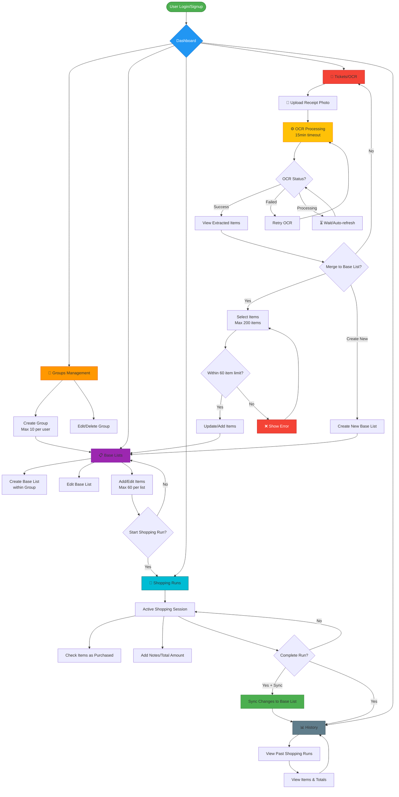
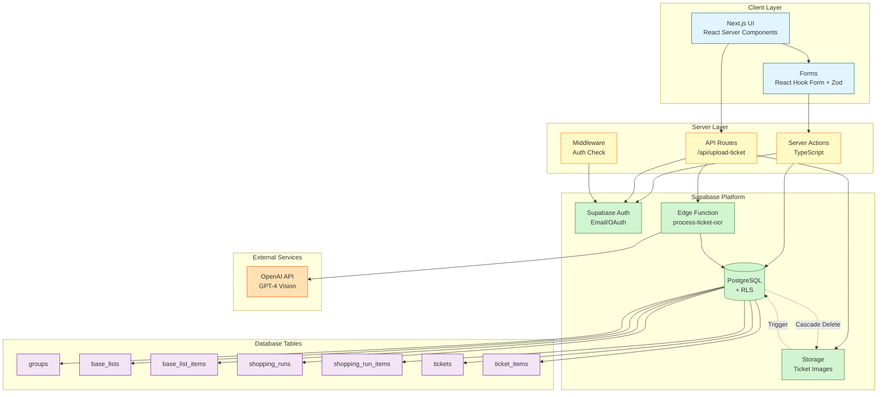
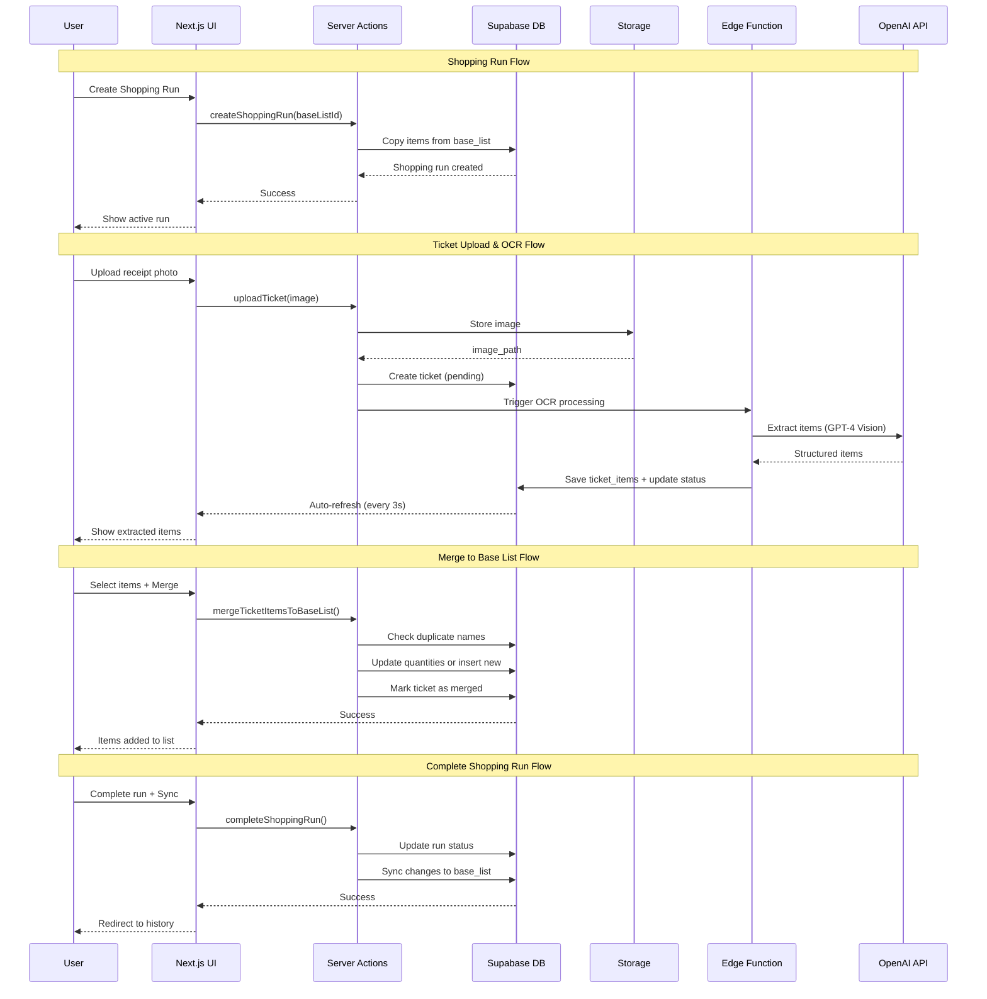
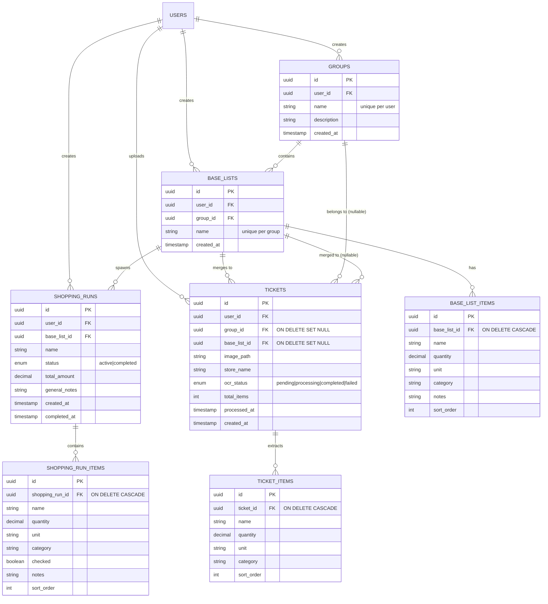

# Listys - Smart Shopping List Manager

A modern SaaS application for managing grocery shopping lists with intelligent OCR-powered receipt processing.

## 📋 Table of Contents

- [Features](#features)
- [System Architecture](#system-architecture)
- [Tech Stack](#tech-stack)
- [Getting Started](#getting-started)
- [Project Structure](#project-structure)
- [Database Schema](#database-schema)
- [Business Logic & Limits](#business-logic--limits)
- [Security & Validation](#security--validation)
- [Development](#development)
- [Deployment](#deployment)

## Features

### Core Functionality

- 📋 **Base Lists** - Create reusable shopping list templates organized by groups
- 🛒 **Shopping Runs** - Interactive checklist sessions with real-time progress tracking
- 📸 **OCR Processing** - Extract items from receipt photos using AI (OpenAI GPT-4 Vision)
- 📊 **History Tracking** - View past shopping sessions with totals and details
- 🔄 **Smart Sync** - Optionally sync shopping run changes back to base lists
- 🏪 **Multi-Store Support** - Organize lists by store or category groups

### Quality & Reliability

- ✅ **Error Boundaries** - Graceful error handling at root and authenticated layouts
- 🔄 **OCR Retry System** - Manual retry for failed OCR with automatic failure detection (15min timeout)
- 🗑️ **Storage Cleanup** - Automatic deletion of orphaned images via database triggers
- 🔒 **Duplicate Prevention** - Case-insensitive validation prevents duplicate group/list names
- 📊 **Loading States** - Visual feedback on all mutations to prevent double-submit
- 🛡️ **DoS Protection** - Array limits and validation to prevent abuse
- 🎯 **User Limits** - Configurable limits (10 groups max, 60 items per list)

## System Architecture

### User Flow & Features



### Technical Architecture



### Data Flow Diagram



### Entity Relationship Diagram



## Tech Stack

- **Framework**: Next.js 14+ (App Router) with TypeScript
- **Database**: Supabase (PostgreSQL + Row Level Security)
- **Auth**: Supabase Auth
- **Storage**: Supabase Storage (receipt images)
- **AI**: OpenAI API (GPT-4 Vision for OCR)
- **UI**: Tailwind CSS + shadcn/ui
- **State**: Zustand
- **Forms**: React Hook Form + Zod
- **Testing**: Jest + Playwright

## Getting Started

### Prerequisites

- Node.js 18+
- pnpm
- Supabase account
- OpenAI API key

### Installation

```bash
# Install dependencies
pnpm install

# Setup environment variables
cp .env.example .env.local
# Edit .env.local with your credentials

# Initialize Supabase (if using local dev)
npx supabase init
npx supabase start

# Run database migrations
npx supabase db push

# Install shadcn/ui components
npx shadcn@latest init
npx shadcn@latest add button dialog dropdown-menu checkbox badge input label card form

# Start development server
pnpm dev
```

### Environment Variables

See [.env.example](.env.example) for required environment variables.

## Project Structure

```bash
src/
├── actions/          # Server Actions (mutations)
├── app/              # Next.js App Router pages
├── components/       # React components
├── data/             # Constants and static data
├── features/         # Feature-specific types
├── hooks/            # Custom React hooks
├── lib/              # Utilities and clients
├── providers/        # React context providers
└── utils/            # Helper functions
```

## Database Schema

See [supabase/migrations](supabase/migrations) for the complete schema.

### Main Tables

- `groups` - Organization units (e.g., "Walmart", "Costco")
- `base_lists` - Reusable shopping list templates
- `base_list_items` - Items in base lists (max 250 per list)
- `shopping_runs` - Individual shopping sessions
- `shopping_run_items` - Items in shopping runs
- `tickets` - Uploaded receipt metadata with OCR status
- `ticket_items` - OCR-extracted items from receipts

### Key Constraints

- **Groups**: Max 10 per user, unique names (case-insensitive)
- **Base Lists**: Max 250 items per list, unique names within group
- **Tickets**: ON DELETE SET NULL for group_id and base_list_id
- **Items**: CASCADE delete when parent is deleted
- **Storage**: Automatic cleanup trigger on ticket deletion

## Business Logic & Limits

All limits are centralized in [src/lib/config/limits.ts](src/lib/config/limits.ts) for easy modification.

### Configurable Limits

```typescript
MAX_GROUPS_PER_USER = 10 // Maximum groups per user
MAX_ITEMS_PER_BASE_LIST = 250 // Maximum items per list (any method)
MAX_TICKET_ITEMS_MERGE = 200 // Maximum items to merge from ticket
MAX_SYNC_ITEMS = 250 // Maximum items to sync (matches base list limit)
```

**Why 250 for base lists and sync?**

- Prevents inconsistent states (e.g., syncing a 250-item run to a 250-item list works)
- Supports large shopping trips (Costco, Sam's Club, bulk purchases)
- PostgreSQL handles 250 rows efficiently
- Future: UI pagination for lists >50 items

### Data Flow

1. **Base Lists** serve as templates (max 250 items each)
2. **Shopping Runs** are created by copying Base Lists
3. **Tickets** are processed via Edge Function → OpenAI API
4. **OCR Results** can merge into Base Lists (max 200 items, validates 250 limit)
5. **Completed Runs** optionally sync changes back to Base Lists (max 250 items)
6. **Storage Cleanup** happens automatically on ticket deletion

### Migrations Applied

- `20260109000000_initial_schema.sql` - Core schema
- `20260109000001_storage_setup.sql` - Storage buckets and policies
- `20260121000000_handle_orphaned_tickets.sql` - Orphaned tickets index and function
- `20260121000001_fix_merged_tickets_group_id.sql` - Fix historical merged tickets
- `20260121000002_auto_fail_stuck_ocr_tickets.sql` - Auto-fail stuck OCR (15min)
- `20260121000003_cleanup_orphaned_storage_images.sql` - Storage cleanup trigger

### Key Functions

- `get_orphaned_tickets_count()` - Count tickets with NULL group_id
- `mark_stuck_tickets_as_failed()` - Auto-fail tickets in processing > 15 minutes
- `delete_ticket_storage_image()` - Trigger to cleanup storage on ticket delete
- `get_orphaned_storage_images()` - List images without tickets
- `cleanup_orphaned_storage_images()` - Delete orphaned image
  MAX_ITEMS_PER_BASE_LIST = 60 // Maximum items per list
  MAX_TICKET_ITEMS_MERGE = 200 // Maximum items to merge from ticket
  MAX_SYNC_ITEMS = 500 // Maximum items to sync (backstop)

### Validation Rules

- **Groups**:
  - Max 10 per user
  - Unique names (case-insensitive)
  - Name: 1-100 characters
  - Description: 0-500 characters

- **Base Lists**:
  - Max 250 items per list (via any method: manual, merge, sync)
  - Unique names within group (case-insensitive)
  - Name: 1-100 characters
  - Validation on create, update, merge, and sync

- **Tickets**:
  - Max 200 items per merge operation
  - Can create new base lists from tickets (validates 250 limit)
  - Image validation before OCR retry
  - Auto-fail if stuck in processing > 15 minutes
  - Storage cleanup on delete

- **Shopping Runs**:
  - Max 250 items when syncing back to base lists
  - Matches base list limit for consistency
  - Prevents impossible states (e.g., list too large to sync)

- **String Limits**:
  - Item names: 200 characters
  - Store names: 100 characters
  - Units: 20 characters
  - Categories: 50 characters
  - Notes: 500 characters

### OCR Processing

- **Statuses**: `pending` → `processing` → `completed` | `failed`
- **Auto-fail**: Tickets stuck > 15 minutes
- **Retry**: Manual retry with image validation
- **Storage**: Automatic cleanup on ticket deletion

## Security & Validation

### Row Level Security (RLS)

All tables have RLS policies ensuring:

- Users can only access their own data
- All queries filtered by `user_id`
- No cross-user data leakage

### Server-Side Validation

- **Zod Schemas**: All inputs validated with TypeScript types
- **Server Actions**: All mutations happen server-side
- **Unknown Types**: Force explicit validation (never trust client)
- **Array Limits**: Prevent DoS attacks via oversized arrays
- **Duplicate Prevention**: Case-insensitive name checks

### Error Handling

- **Error Boundaries**: Root and authenticated layouts
- **Loading States**: All forms show loading spinners
- **Dialog Protection**: Cannot close during submission
- **Toast Notifications**: User feedback on all operations
- **Graceful Degradation**: Clear error messages

### Data Flow

1. **Base Lists** serve as templates
2. **Shopping Runs** are created by copying Base Lists
3. **Tickets** are processed via Edge Function → OpenAI API
4. **OCR Results** can merge into Base Lists
5. **Completed Runs** optionally sync changes back to Base Lists

## Development

```bash
# Run dev server
pnpm dev

# Run type checking
pnpm type-check

# Run linter
pnpm lint

# Run tests
pnpm test

# Run E2E tests
pnpm test:e2e
```

## Deployment

Designed for deployment on Vercel with Supabase.

```bash
# Build for production
pnpm build

# Start production server
pnpm start
```

## License

MIT
