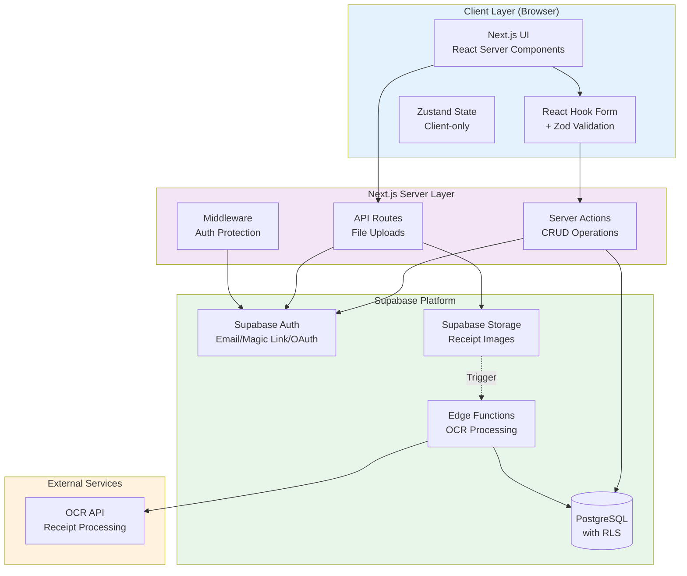
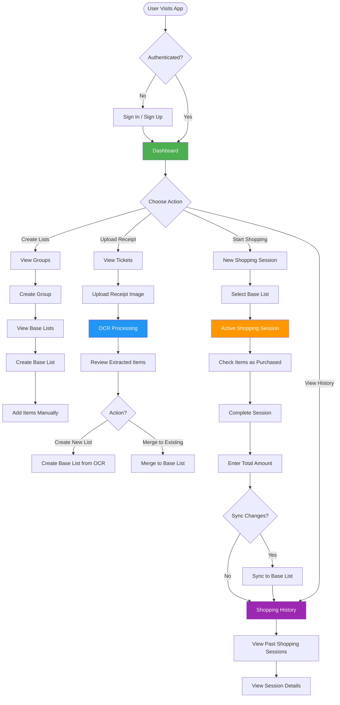
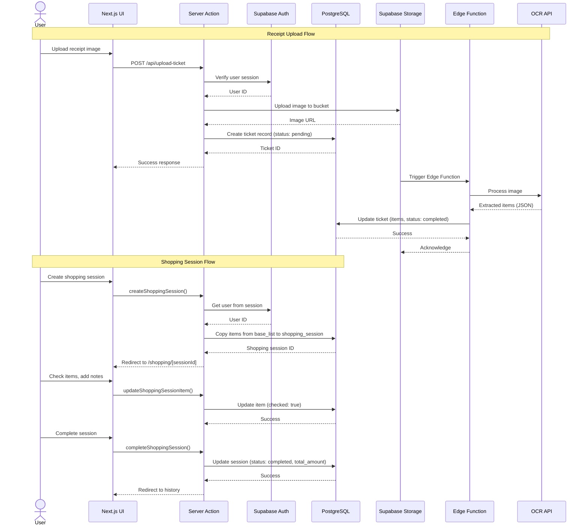
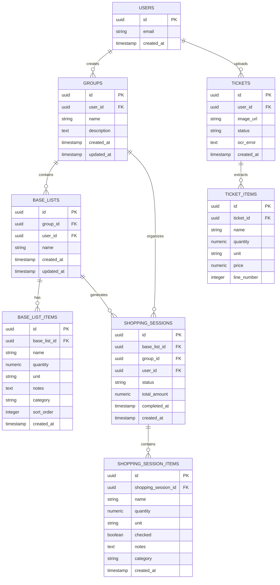

# Listys - Smart Shopping List Manager

**Listys** is a modern, full-stack SaaS application designed to simplify grocery shopping and expense tracking. It combines the power of **OCR technology** with intelligent shopping list management, allowing users to digitize receipts, organize shopping lists, and track their shopping history efficiently.

---

## Table of Contents

- [Overview](#overview)
- [Core Features](#core-features)
- [Quality & Reliability Features](#quality--reliability-features)
- [Architecture Diagrams](#architecture-diagrams)
  - [System Architecture](#system-architecture)
  - [User Flow](#user-flow)
  - [Data Flow](#data-flow)
  - [Entity Relationship Diagram (ERD)](#entity-relationship-diagram-erd)
- [Tech Stack](#tech-stack)
- [Business Logic & Limits](#business-logic--limits)
- [Security & Validation](#security--validation)
- [Database Schema](#database-schema)
- [Getting Started](#getting-started)
- [Development](#development)
- [Deployment](#deployment)

---

## Overview

Listys addresses the common challenges of grocery shopping:

1. **Lost Receipts** → Upload receipts and extract items automatically with AI
2. **Repetitive Planning** → Create reusable base shopping lists
3. **Budget Tracking** → Track spending across shopping sessions
4. **History Management** → View past purchases and spending patterns

**Target Users:** Families, meal planners, budget-conscious shoppers, and anyone who wants to streamline their grocery shopping process.

**Value Proposition:** Transform paper receipts into structured shopping data, eliminate repetitive list creation, and gain insights into spending habits.

---

## Core Features

### 1. **Group & List Organization**

- Create **shopping list groups** (e.g., "Weekly Groceries", "Costco Trips", "Meal Prep")
- Build **base lists** with commonly purchased items
- Maximum 10 groups per user to maintain focus

### 2. **AI Receipt Processing**

- Upload receipt images (JPEG, PNG, HEIC)
- AI-powered extraction of items, quantities, and prices using OpenAI Vision API
- Manual review and editing before creating lists
- Merge extracted items into existing base lists (up to 200 items)

### 3. **Active Shopping Sessions**

- Create shopping sessions from base lists
- Real-time item checking as you shop
- Add/remove items on the fly
- Complete sessions with total amount tracking

### 4. **Shopping History**

- View all completed shopping sessions by group
- Track spending over time
- Date and amount details for each session

### 5. **Smart Syncing**

- Sync shopping session changes back to base lists
- Keep base lists updated with your actual purchases
- Maximum 250 items per sync to maintain performance

---

## Quality & Reliability Features

### **User Experience**

- ✅ Loading states on all mutations (prevent double-submit)
- ✅ Toast notifications for user feedback (success/error)
- ✅ Error boundaries at root and authenticated layouts
- ✅ Responsive design (mobile-first approach)
- ✅ Consistent Edit/Delete button ordering (Edit left, Delete right)
- ✅ Disabled inputs during submission

### **Data Integrity**

- ✅ Server-side validation with Zod schemas
- ✅ Case-insensitive duplicate prevention
- ✅ Configurable limits to prevent DoS attacks
- ✅ Automatic cleanup of orphaned records (database triggers)
- ✅ Foreign key cascades for referential integrity

### **Performance**

- ✅ Optimized database indexes on foreign keys
- ✅ Server Components by default (Client Components when needed)
- ✅ Edge Functions for AI receipt processing (15-minute timeout)
- ✅ Efficient RLS policies with auth.uid() filtering

### **Monitoring & Recovery**

- ✅ Automatic OCR retry mechanism (15-minute timeout)
- ✅ Failed OCR tickets auto-marked for manual review
- ✅ Error messages with actionable feedback
- ✅ Storage cleanup for orphaned images (7+ days)

---

## Architecture Diagrams

### System Architecture



### User Flow



### Data Flow



### Entity Relationship Diagram (ERD)



---

## Tech Stack

### **Frontend**

- **Framework:** Next.js 16.1.0 (App Router, Turbopack)
- **Language:** TypeScript (strict mode)
- **UI Library:** React 19.2.3
- **Styling:** Tailwind CSS 4
- **Components:** shadcn/ui (Radix UI primitives)
- **Icons:** HugeIcons React + Lucide React
- **Animations:** Framer Motion 12.25
- **Forms:** React Hook Form 7.54 + Zod 3.24
- **State Management:** Zustand (client-only state)
- **Notifications:** Sonner (toast)

### **Backend**

- **Platform:** Supabase
- **Database:** PostgreSQL (with Row Level Security)
- **Authentication:** Supabase Auth (email, magic link, OAuth)
- **Storage:** Supabase Storage (receipt images)
- **Functions:** Supabase Edge Functions (Deno runtime)

### **Development**

- **Package Manager:** pnpm
- **Linting:** ESLint 9.20
- **Code Quality:** TypeScript strict mode
- **Testing:** Jest + Playwright (planned)

### **Deployment**

- **Hosting:** Vercel (Next.js)
- **Database:** Supabase Cloud
- **CDN:** Vercel Edge Network

---

## Business Logic & Limits

All configurable limits are centralized in [`lib/config/limits.ts`](../src/lib/config/limits.ts):

> Note: The file `src/lib/validations/README.md` previously contained older limit values (e.g. 60 items). The authoritative values are in `src/lib/config/limits.ts`. Update docs or that README when limits change to avoid drift.

| Limit                       | Value | Rationale                                                                                |
| --------------------------- | ----- | ---------------------------------------------------------------------------------------- |
| **MAX_GROUPS_PER_USER**     | 10    | Prevents database bloat, encourages focused organization                                 |
| **MAX_ITEMS_PER_BASE_LIST** | 250   | Supports large shopping trips (Costco, restaurant supply), efficient PostgreSQL handling |
| **MAX_TICKET_ITEMS_MERGE**  | 200   | Most receipts have <100 items, still allows large merges                                 |
| **MAX_SYNC_ITEMS**          | 250   | Matches base list limit to prevent inconsistent states                                   |

### **Design Decisions:**

1. **Consistent Limits:** `MAX_SYNC_ITEMS = MAX_ITEMS_PER_BASE_LIST` prevents impossible states (e.g., syncing 300 items to a list capped at 250)

2. **DoS Prevention:** Array limits on all server actions prevent resource exhaustion attacks

3. **Future Enhancement:** Limits can be made configurable per user plan (free, pro, enterprise)

4. **Performance:** 250 items ≈ <25KB JSON data, handled efficiently by PostgreSQL

---

## Security & Validation

### **Security Model: RLS-First**

- ✅ **All security lives in Row Level Security (RLS) policies**
- ✅ Frontend never trusts critical client data
- ✅ Sensitive actions → Server Actions or API Routes only
- ✅ Permissions are **deny by default**

### **RLS Policies Pattern**

Every user-facing table has RLS enabled:

```sql
ALTER TABLE table_name ENABLE ROW LEVEL SECURITY;

CREATE POLICY "Users can view their own items"
  ON table_name FOR SELECT
  USING (auth.uid() = user_id);

CREATE POLICY "Users can insert their own items"
  ON table_name FOR INSERT
  WITH CHECK (auth.uid() = user_id);
```

### **Validation Architecture**

1. **Server-Side Only:** All inputs validated with Zod schemas in `lib/validations/`
2. **Configurable Limits:** Reference `lib/config/limits.ts` in schemas
3. **Array Limits:** Prevent DoS attacks (e.g., max 250 items per request)
4. **Duplicate Prevention:** Case-insensitive checks using `.ilike()`
5. **Error Messages:** Actionable feedback with limit values

**Example Schema:**

```typescript
import { z } from 'zod'
import { MAX_ITEMS_PER_BASE_LIST } from '@/lib/config/limits'

export const createBaseListSchema = z.object({
	group_id: z.string().uuid(),
	name: z.string().min(1, 'Name is required').max(100),
	items: z
		.array(z.object({ name: z.string(), quantity: z.number() }))
		.max(MAX_ITEMS_PER_BASE_LIST, `Cannot exceed ${MAX_ITEMS_PER_BASE_LIST} items`),
})
```

### **Server Action Pattern**

```typescript
export async function createItem(data: unknown) {
	// 1. Authentication
	const {
		data: { user },
	} = await supabase.auth.getUser()
	if (!user) return { error: 'Unauthorized' }

	// 2. Input validation
	const validation = schema.safeParse(data)
	if (!validation.success) {
		return { error: validation.error.errors[0].message }
	}

	// 3. Business logic validation (limits, duplicates)
	const { count } = await supabase.from('items').select('*', { count: 'exact', head: true }).eq('user_id', user.id)

	if (count >= MAX_ITEMS) {
		return { error: `Maximum ${MAX_ITEMS} items allowed` }
	}

	// 4. Database operation
	const { error } = await supabase.from('items').insert({ ...validation.data, user_id: user.id })

	if (error) return { error: error.message }

	// 5. Revalidate & return
	revalidatePath('/items')
	return { success: true }
}
```

---

## Database Schema

### **Core Tables**

1. **`auth.users`** (Supabase managed)
   - User authentication and profiles

2. **`groups`**
   - Shopping list groups (e.g., "Weekly Groceries")
   - Fields: `id`, `user_id`, `name`, `description`, `created_at`, `updated_at`
   - Cascades: Delete group → deletes all base_lists and shopping_sessions

3. **`base_lists`**
   - Reusable shopping list templates
   - Fields: `id`, `group_id`, `user_id`, `name`, `created_at`, `updated_at`
   - Cascades: Delete base_list → deletes all base_list_items

4. **`base_list_items`**
   - Items in base lists
   - Fields: `id`, `base_list_id`, `name`, `quantity`, `unit`, `notes`, `category`, `sort_order`, `created_at`, `updated_at`

5. **`shopping_sessions`**
   - Active or completed shopping sessions
   - Fields: `id`, `base_list_id`, `group_id`, `user_id`, `status` (enum: active, completed), `total_amount`, `completed_at`, `created_at`, `updated_at`
   - Cascades: Delete shopping_session → deletes all shopping_session_items

6. **`shopping_session_items`**
   - Items in shopping sessions (copied from base_list_items)
   - Fields: `id`, `shopping_session_id`, `name`, `quantity`, `unit`, `checked`, `notes`, `category`, `created_at`, `updated_at`

7. **`tickets`**
   - Uploaded receipts for OCR processing
   - Fields: `id`, `user_id`, `image_url`, `status` (enum: pending, processing, completed, failed), `ocr_error`, `created_at`, `updated_at`
   - Cascades: Delete ticket → deletes all ticket_items

8. **`ticket_items`**
   - Items extracted from OCR processing
   - Fields: `id`, `ticket_id`, `name`, `quantity`, `unit`, `price`, `line_number`, `created_at`

### **Database Triggers**

1. **Auto-fail Stuck OCR Tickets** (runs hourly)
   - Marks tickets as "failed" if processing >15 minutes
   - Allows manual retry

2. **Cleanup Orphaned Storage Images** (runs daily)
   - Deletes images from storage if ticket deleted
   - Only removes images older than 7 days

3. **Handle Orphaned Tickets** (on base_list delete)
   - If base_list created from ticket is deleted → marks ticket as "pending" for reuse

### **Indexes**

All foreign keys have indexes for performance:

- `idx_groups_user_id`
- `idx_base_lists_user_id`, `idx_base_lists_group_id`
- `idx_shopping_sessions_user_id`, `idx_shopping_sessions_group_id`
- `idx_tickets_user_id`

---

## Getting Started

### **Prerequisites**

- Node.js 18+ (recommended: 20+)
- pnpm 9+
- Supabase CLI
- Supabase account (free tier works)

### **Local Setup**

1. **Clone the repository:**

```bash
git clone <repository-url>
cd listys-web-app
```

2. **Install dependencies:**

```bash
pnpm install
```

3. **Set up Supabase:**

```bash
# Initialize Supabase (if not already done)
npx supabase init

# Start local Supabase (Docker required)
npx supabase start
```

4. **Configure environment variables:**

Create `.env.local`:

```bash
NEXT_PUBLIC_SUPABASE_URL=<your-supabase-url>
NEXT_PUBLIC_SUPABASE_ANON_KEY=<your-supabase-anon-key>
SUPABASE_SERVICE_ROLE_KEY=<your-service-role-key>
```

5. **Run database migrations:**

```bash
npx supabase db push
```

6. **Start development server:**

```bash
pnpm dev
```

Visit [http://localhost:3000](http://localhost:3000)

---

## Development

### **Commands**

```bash
pnpm dev          # Start development server
pnpm build        # Build for production
pnpm start        # Start production server
pnpm lint         # Run ESLint
tsc --noEmit      # Type checking (no script in package.json)
```

### **Supabase Commands**

```bash
npx supabase start                    # Start local Supabase
npx supabase stop                     # Stop local Supabase
npx supabase db push                  # Push migrations to database
npx supabase migration new <name>     # Create new migration
npx supabase functions deploy         # Deploy Edge Functions
npx supabase gen types typescript     # Generate TypeScript types
```

### **Project Structure**

```bash
src/
├── actions/              # Server Actions (CRUD by domain)
├── app/
│   ├── (authenticated)   # Protected routes
│   ├── (marketing)       # Public landing pages
│   ├── api/              # API routes (file uploads)
│   └── auth/             # Auth pages
├── components/
│   ├── app/              # App-specific (header, sidebar)
│   ├── features/         # Feature components by domain
│   ├── ui/               # shadcn/ui components
│   └── commons/          # Shared components
├── lib/
│   ├── config/           # Configurable limits and settings
│   ├── supabase/         # Supabase clients (server, client)
│   ├── validations/      # Zod schemas by domain
│   └── utils.ts          # Utilities (cn, etc.)
└── utils/                # Helper functions (formatters, etc.)

supabase/
├── config.toml
├── functions/            # Edge Functions
└── migrations/           # SQL migrations (timestamped)
```

### **Code Guidelines**

- **Import Order:** Directives → React → Next.js → External → Internal
- **Naming:** kebab-case for files, camelCase for variables, PascalCase for components
- **Error Handling:** Server actions use early returns, client components use try-catch
- **Validation:** All server actions validate with Zod schemas
- **Types:** Prefer `unknown` for inputs, `interface` for component props

See [AGENTS.md](../AGENTS.md) for detailed coding guidelines.

---

## Deployment

### **Vercel Deployment**

1. **Connect repository to Vercel:**
   - Import project from GitHub/GitLab
   - Select `listys-web-app` repository

2. **Configure environment variables:**
   - `NEXT_PUBLIC_SUPABASE_URL`
   - `NEXT_PUBLIC_SUPABASE_ANON_KEY`
   - `SUPABASE_SERVICE_ROLE_KEY`

3. **Deploy:**
   - Vercel will automatically build and deploy
   - Production URL: `https://listys.vercel.app` (or custom domain)

### **Supabase Production**

1. **Create project:**
   - Go to [supabase.com](https://supabase.com)
   - Create new project
   - Copy connection details

2. **Link local project:**

```bash
npx supabase link --project-ref <your-project-ref>
```

3. **Push migrations:**

```bash
npx supabase db push
```

4. **Deploy Edge Functions:**

```bash
npx supabase functions deploy process-ticket-ocr
```

5. **Configure Storage:**
   - Create `ticket-images` bucket
   - Set up RLS policies for user-specific access
   - Enable automatic image optimization

### **Post-Deployment Checklist**

- [ ] Verify environment variables in Vercel
- [ ] Test authentication flows (sign in, sign up, magic link)
- [ ] Test OCR upload and processing
- [ ] Verify storage bucket permissions
- [ ] Enable Supabase Edge Function logging
- [ ] Set up error monitoring (Sentry/LogRocket)
- [ ] Configure custom domain (if applicable)

---

## License

MIT License - See [LICENSE](../LICENSE) for details

---

## Support

For questions or issues, please:

- Open an issue on GitHub
- Contact support at support@listys.app
- Check the [AGENTS.md](../AGENTS.md) for technical guidelines

---

**Built with ❤️ using Next.js, Supabase, and TypeScript**
