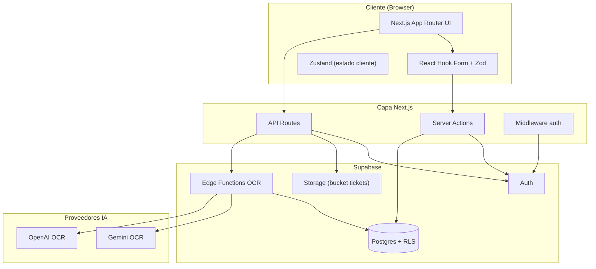
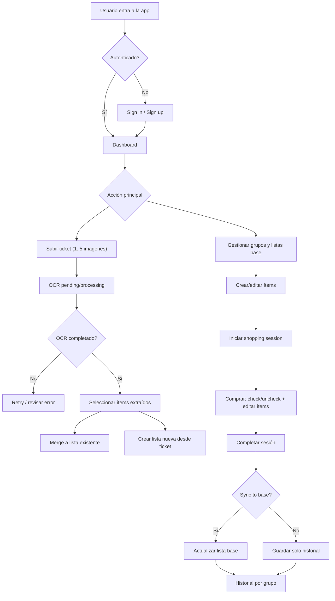
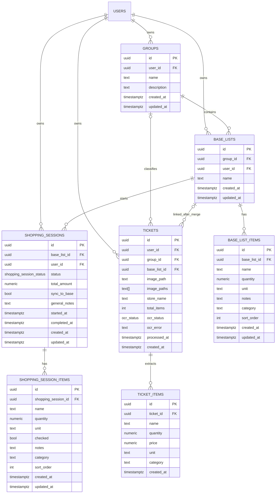
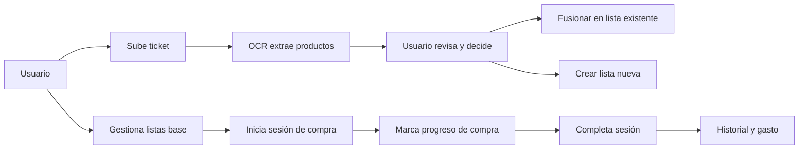
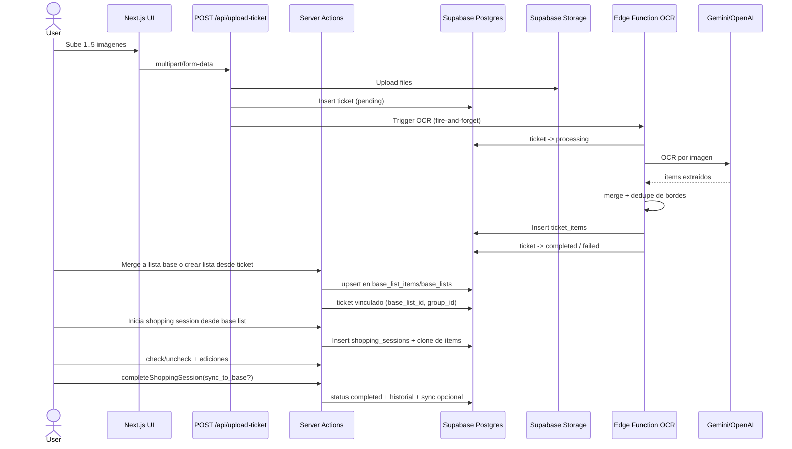

# Listys Web App

Aplicación SaaS full-stack para planificación de compras y digitalización de tickets con IA.

## 1. Resumen Ejecutivo

**Listys** permite gestionar listas de compra reutilizables, ejecutar sesiones de compra en tiempo real y convertir tickets en datos estructurados mediante OCR.

### Problemas que resuelve

- Evita reconstruir listas manualmente en cada compra.
- Reduce pérdida de información de tickets físicos.
- Facilita el seguimiento histórico de sesiones y gasto total.
- Sincroniza aprendizaje de compras reales hacia listas base.

### Estado actual del producto

- Núcleo funcional completo en producción local (auth, listas, sesiones, tickets OCR, historial).
- Arquitectura `Next.js App Router + Supabase` con seguridad basada en RLS.
- OCR con proveedor configurable (`Gemini` u `OpenAI`) mediante Edge Functions.

## 2. Features Implementadas (Auditadas en Código)

## 2.1 Autenticación y Acceso

- Registro e inicio de sesión con email/password.
- OAuth con Google.
- Callback server-side para intercambio de sesión.
- Protección de rutas autenticadas con middleware y validación de sesión.

Rutas relevantes:
- `/auth/signin`
- `/auth/signup`
- `/auth/callback`

## 2.2 Dashboard

- Vista consolidada con métricas rápidas:
  - número de grupos,
  - tickets cargados,
  - sesiones completadas.
- Detección de sesión activa y acceso directo para continuar compra.
- Carga asíncrona con `Suspense` y skeletons.

Ruta relevante:
- `/(authenticated)/dashboard`

## 2.3 Gestión de Grupos de Listas

- CRUD completo de grupos.
- Límite por usuario: **10 grupos**.
- Prevención de nombres duplicados (case-insensitive con `.ilike`).
- Vista de grupos con conteo de listas base.
- Vista de historial por grupo (solo grupos con sesiones completadas).

Rutas relevantes:
- `/(authenticated)/shopping-lists`
- `/(authenticated)/shopping-history`
- `/(authenticated)/shopping-history/[groupId]`

## 2.4 Listas Base (Plantillas de Compra)

- CRUD completo de listas base por grupo.
- Prevención de duplicados por nombre dentro del mismo grupo.
- Gestión de ítems de lista base:
  - crear,
  - editar,
  - eliminar,
  - orden por `sort_order`.
- Límite por lista base: **250 ítems**.

Rutas relevantes:
- `/(authenticated)/shopping-lists/[groupId]/lists`
- `/(authenticated)/base-lists/[baseListId]/edit`

## 2.5 Sesiones de Compra (Shopping Sessions)

- Creación de sesión desde lista base (clonado de ítems).
- Regla de negocio: **1 sesión activa por usuario**.
- Gestión de ítems durante la sesión:
  - check/uncheck,
  - edición,
  - alta/baja de ítems en caliente.
- Progreso visual (% completado).
- Finalización con:
  - monto total opcional,
  - notas generales,
  - sincronización opcional a lista base (`sync_to_base`).
- Cancelación de sesión activa.

Ruta relevante:
- `/(authenticated)/shopping/[runId]`

## 2.6 Historial

- Historial global de sesiones completadas.
- Historial filtrado por grupo.
- Tarjetas de historial con fecha/hora y monto total.
- Navegación a detalle de sesión completada.

Rutas relevantes:
- `/(authenticated)/shopping-history`
- `/(authenticated)/shopping-history/[groupId]`

## 2.7 Tickets + OCR con IA

- Carga de ticket con **múltiples imágenes** (hasta 5).
- Validación en servidor:
  - mínimo 1 imagen,
  - máximo 5,
  - solo imágenes,
  - tamaño máximo 10MB por imagen.
- Estado OCR en ticket:
  - `pending`, `processing`, `completed`, `failed`.
- Extracción de ítems a `ticket_items` usando Edge Function.
- Reintento manual de OCR (`retry`).
- Registro de error OCR (`ocr_error`).
- Eliminación de ticket con limpieza de imagen en storage.
- Merge de ítems del ticket hacia lista base existente.
- Creación de nueva lista base desde ítems OCR.
- Asignación manual de ticket a grupo.

Rutas relevantes:
- `/(authenticated)/tickets`
- `/(authenticated)/tickets/[ticketId]`
- `POST /api/upload-ticket`
- `GET /api/tickets/[ticketId]/status`

## 2.8 Estado Activo en Cliente

- Store de sesión activa con Zustand.
- Inicialización de estado en cliente al cargar app.
- Suscripción realtime a cambios en `shopping_sessions` para reflejar sesión activa en UI.

## 3. Arquitectura Técnica

## 3.1 Stack

- `Next.js 16.1.0` (App Router)
- `React 19`
- `TypeScript`
- `Supabase` (Auth, Postgres, Storage, Edge Functions)
- `Tailwind CSS v4` + `shadcn/ui`
- `Zod` + `react-hook-form`
- `Zustand` (estado cliente)
- `Sonner` (toasts)
- `Framer Motion` (marketing/auth UI)

## 3.2 Estructura de capas

- `src/app`: rutas, layouts, API routes.
- `src/actions`: server actions (dominio de negocio).
- `src/components/features`: UI por feature.
- `src/lib/validations`: contratos Zod.
- `src/lib/config`: límites y configuración OCR.
- `supabase/migrations`: esquema e integridad en DB.
- `supabase/functions`: procesamiento OCR.

## 3.3 Principios de diseño aplicados

- Seguridad centrada en RLS (no en frontend).
- Validación server-side con Zod antes de mutar datos.
- Límites de negocio centralizados y reutilizados.
- Revalidación selectiva de rutas con `revalidatePath`.
- Flujo de errores explícito con respuestas `{ error }` en server actions.

## 3.4 Diagramas (Mermaid)

### Arquitectura del sistema



### Flujo de usuario (alto nivel)



### Modelo de datos (ERD)



## 3.5 Vista simplificada (negocio)



## 3.6 Vista detallada (ingeniería)



## 4. Modelo de Datos (Dominio)

Entidades principales:

- `groups`: agrupación lógica de listas.
- `base_lists`: plantillas de compra por grupo.
- `base_list_items`: ítems de plantilla.
- `shopping_sessions`: ejecución de compra.
- `shopping_session_items`: ítems de sesión.
- `tickets`: metadatos de tickets + estado OCR.
- `ticket_items`: ítems extraídos por OCR.

Relaciones clave:

- `groups` -> `base_lists` (`ON DELETE CASCADE`).
- `base_lists` -> `base_list_items` (`ON DELETE CASCADE`).
- `base_lists` -> `shopping_sessions` (`ON DELETE CASCADE`).
- `shopping_sessions` -> `shopping_session_items` (`ON DELETE CASCADE`).
- `tickets.group_id` y `tickets.base_list_id` con `ON DELETE SET NULL` (tickets huérfanos controlados).

## 5. Seguridad e Integridad

## 5.1 RLS

- Todas las tablas de usuario tienen Row Level Security.
- Políticas basadas en `auth.uid() = user_id` o validación por relación padre.
- Bucket `tickets` protegido por carpeta con prefijo del `user_id`.

## 5.2 Integridad operativa

- Triggers `updated_at` en tablas de dominio.
- Trigger para borrar imagen de storage al borrar ticket.
- Funciones SQL para detectar/limpiar imágenes huérfanas.
- Función SQL para auto-marcar tickets OCR atascados como `failed`.

## 6. Pipeline OCR

1. Cliente sube 1..5 imágenes a `POST /api/upload-ticket`.
2. API route valida y sube a `storage.objects` (`tickets`).
3. Se crea ticket con `ocr_status = pending`.
4. Se dispara Edge Function según proveedor configurado:
   - `process-ticket-ocr-gemini` o
   - `process-ticket-ocr-openai`.
5. Edge Function:
   - cambia estado a `processing`,
   - procesa imágenes en secuencia,
   - aplica deduplicación de borde entre imágenes,
   - inserta `ticket_items`,
   - actualiza ticket a `completed` y `total_items`.
6. Si falla, estado final en `failed` (con soporte para reintento manual).

Configuración:

- `PROCESS_TICKET_OCR_PROVIDER=gemini|openai`
- default actual: `gemini`

## 7. Límites de Negocio (Código Fuente)

Definidos en `src/lib/config/limits.ts`:

- `MAX_GROUPS_PER_USER = 10`
- `MAX_ITEMS_PER_BASE_LIST = 250`
- `MAX_TICKET_ITEMS_MERGE = 200`
- `MAX_SYNC_ITEMS = 250`
- `MAX_IMAGES_PER_TICKET = 5`

## 8. Rutas Funcionales

Públicas:

- `/`
- `/auth/signin`
- `/auth/signup`
- `/auth/callback`

Autenticadas:

- `/dashboard`
- `/shopping-lists`
- `/shopping-lists/[groupId]/lists`
- `/base-lists/[baseListId]/edit`
- `/shopping/[runId]`
- `/shopping-history`
- `/shopping-history/[groupId]`
- `/tickets`
- `/tickets/[ticketId]`

API:

- `POST /api/upload-ticket`
- `GET /api/tickets/[ticketId]/status`

## 9. Variables de Entorno

Base:

- `NEXT_PUBLIC_SUPABASE_URL`
- `NEXT_PUBLIC_SUPABASE_PUBLISHABLE_KEY`
- `SUPABASE_SERVICE_ROLE_KEY`

OCR:

- `PROCESS_TICKET_OCR_PROVIDER` (`gemini`/`openai`)
- `GEMINI_API_KEY` (si proveedor = gemini)
- `OPENAI_API_KEY` (si proveedor = openai)

## 10. Desarrollo Local

Instalación:

```bash
npm install
```

Levantar app:

```bash
npm run dev
```

Lint:

```bash
npm run lint
```

Type-check:

```bash
tsc --noEmit
```

Supabase local (opcional):

```bash
npx supabase start
npx supabase db push
```

Regenerar tipos DB:

```bash
npm run gen:types
```

## 11. Migraciones Relevantes

- `20260109000000_initial_schema.sql`: esquema base + RLS + triggers.
- `20260109000001_storage_setup.sql`: bucket/policies de tickets.
- `20260121000000_handle_orphaned_tickets.sql`: manejo de tickets sin grupo.
- `20260121000001_fix_merged_tickets_group_id.sql`: consistencia ticket/lista.
- `20260121000002_auto_fail_stuck_ocr_tickets.sql`: OCR stuck -> failed.
- `20260121000003_cleanup_orphaned_storage_images.sql`: cleanup storage.
- `20260127234440_add_ocr_error_column.sql`: trazabilidad de errores OCR.
- `20260128000000_multi_image_tickets.sql`: soporte multiimagen.
- `20260202000000_rename_shopping_runs_to_sessions.sql`: cambio de nomenclatura.

## 12. Estado de Calidad

Actualmente:

- Testing automatizado no configurado (Jest/Playwright pendientes).
- Existe validación robusta en server actions + constraints y RLS en DB.
- Cobertura funcional alta en flujos de negocio críticos.

Riesgos técnicos actuales:

- Sin suite e2e para regresiones de flujos completos (auth, OCR, sesión).
- Dependencia de servicios externos IA para extracción OCR.

## 13. Roadmap Técnico Recomendado

1. Incorporar pruebas E2E de happy-path y fallos OCR.
2. Añadir observabilidad (logs estructurados, trazas por ticketId).
3. Implementar políticas por plan (límites dinámicos por usuario).
4. Agregar analítica de uso y costos OCR por proveedor.
5. Endurecer idempotencia y retries en pipeline OCR.

## 14. Licencia

Definir según estrategia del proyecto (privada/comercial/open-source).
