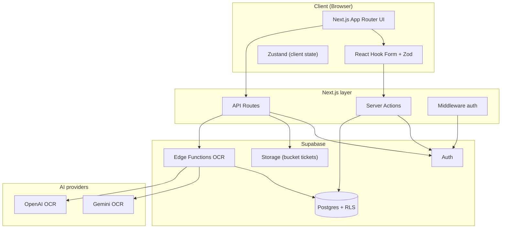
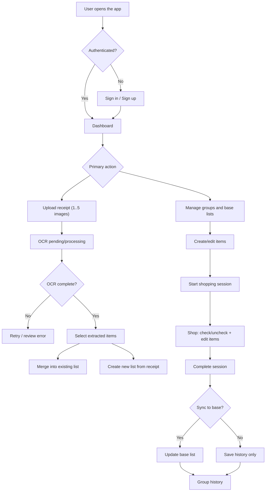
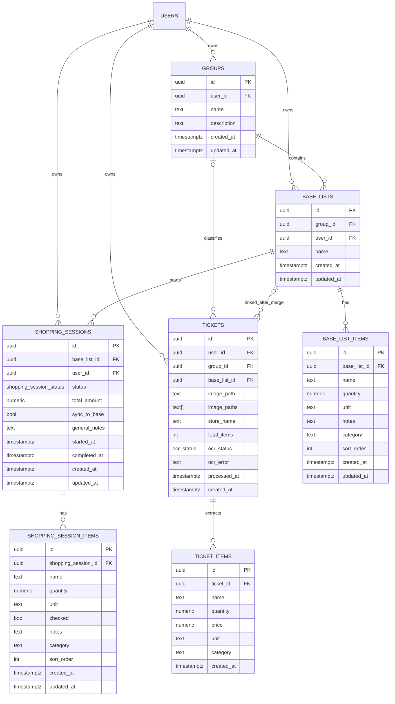
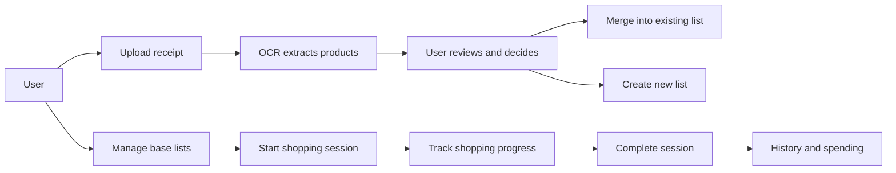
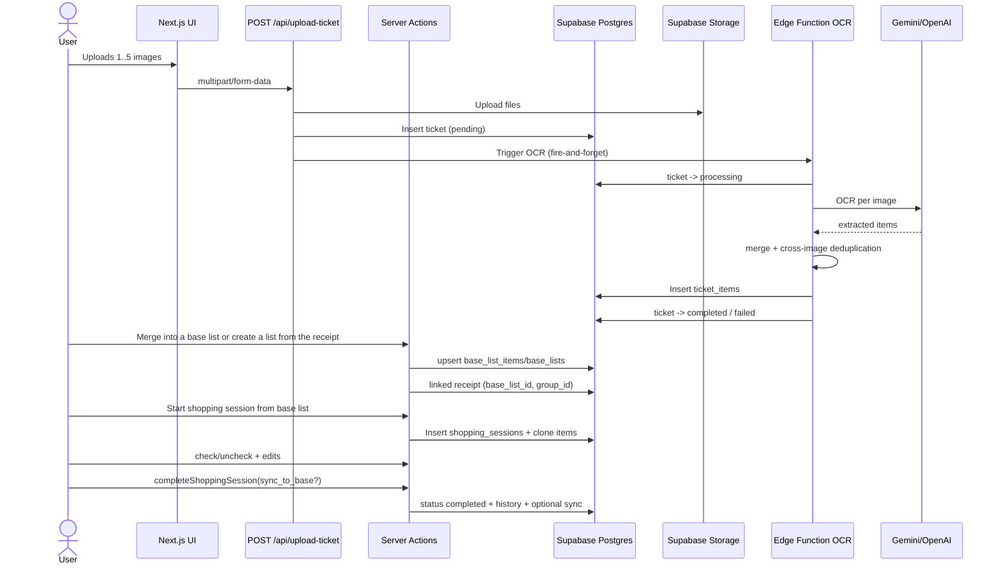

# Listys Web App

Full-stack SaaS application for shopping planning and AI-powered receipt digitization.

## 1. Executive Summary

**Listys** lets users manage reusable shopping lists, run real-time shopping sessions, and convert receipts into structured data through OCR.

### Problems solved

- Avoids rebuilding lists manually for every shopping trip.
- Reduces information loss from physical receipts.
- Makes it easier to track shopping history and total spending.
- Syncs learning from real purchases back to base lists.

### Current product status

- Core functionality is complete in the local production-like environment (auth, lists, sessions, OCR receipts, and history).
- `Next.js App Router + Supabase` architecture with RLS-based security.
- OCR uses a configurable provider (`Gemini` or `OpenAI`) through Edge Functions.

## 2. Implemented Features (Audited Against the Codebase)

## 2.1 Authentication and Access

- Email/password sign-up and sign-in.
- Google OAuth.
- Server-side callback for session exchange.
- Authenticated route protection through middleware and session validation.

Relevant routes:
- `/auth/signin`
- `/auth/signup`
- `/auth/callback`

## 2.2 Dashboard

- Consolidated view with quick metrics:
  - number of groups,
  - uploaded receipts,
  - completed sessions.
- Active-session detection with a direct link to continue shopping.
- Asynchronous loading with `Suspense` and skeletons.

Relevant route:
- `/(authenticated)/dashboard`

## 2.3 List Group Management

- Full CRUD for groups.
- Per-user limit: **10 groups**.
- Duplicate-name prevention (case-insensitive with `.ilike`).
- Group view with base-list counts.
- Group history view (only groups with completed sessions).

Relevant routes:
- `/(authenticated)/shopping-lists`
- `/(authenticated)/shopping-history`
- `/(authenticated)/shopping-history/[groupId]`

## 2.4 Base Lists (Shopping Templates)

- Full CRUD for group-scoped base lists.
- Duplicate-name prevention within the same group.
- Base-list item management:
  - create,
  - edit,
  - delete,
  - ordering by `sort_order`.
- Per-base-list limit: **250 items**.

Relevant routes:
- `/(authenticated)/shopping-lists/[groupId]/lists`
- `/(authenticated)/base-lists/[baseListId]/edit`

## 2.5 Shopping Sessions

- Create a session from a base list (items are cloned).
- Business rule: **1 active session per user**.
- Item management during a session:
  - check/uncheck,
  - editing,
  - add/remove items while the session is active.
- Visual progress (% complete).
- Completion with:
  - optional total amount,
  - general notes,
  - optional sync back to the base list (`sync_to_base`).
- Active-session cancellation.

Relevant route:
- `/(authenticated)/shopping/[runId]`

## 2.6 History

- Global history of completed sessions.
- History filtered by group.
- History cards with date/time and total amount.
- Navigation to completed-session details.

Relevant routes:
- `/(authenticated)/shopping-history`
- `/(authenticated)/shopping-history/[groupId]`

## 2.7 Receipts + AI OCR

- Upload receipts with **multiple images** (up to 5).
- Server-side validation:
  - at least 1 image,
  - at most 5 images,
  - images only,
  - maximum 10MB per image.
- Receipt OCR status:
  - `pending`, `processing`, `completed`, `failed`.
- Extract items into `ticket_items` through an Edge Function.
- Manual OCR retry (`retry`).
- OCR error recording (`ocr_error`).
- Receipt deletion with image cleanup in storage.
- Merge receipt items into an existing base list.
- Create a new base list from OCR items.
- Manually assign a receipt to a group.

Relevant routes:
- `/(authenticated)/tickets`
- `/(authenticated)/tickets/[ticketId]`
- `POST /api/upload-ticket`
- `GET /api/tickets/[ticketId]/status`

## 2.8 Client-side Active Session State

- Active-session store with Zustand.
- Client-side state initialization when the app loads.
- Realtime subscription to `shopping_sessions` changes so the active session is reflected in the UI.

## 3. Technical Architecture

## 3.1 Stack

- `Next.js 16.1.0` (App Router)
- `React 19`
- `TypeScript`
- `Supabase` (Auth, Postgres, Storage, Edge Functions)
- `Tailwind CSS v4` + `shadcn/ui`
- `Zod` + `react-hook-form`
- `Zustand` (client state)
- `Sonner` (toasts)
- `Framer Motion` (marketing/auth UI)

## 3.2 Layered Structure

- `src/app`: routes, layouts, and API routes.
- `src/actions`: server actions (business domain).
- `src/components/features`: feature-specific UI.
- `src/lib/validations`: Zod contracts.
- `src/lib/config`: limits and OCR configuration.
- `supabase/migrations`: database schema and integrity.
- `supabase/functions`: OCR processing.

## 3.3 Applied Design Principles

- Security centered on RLS rather than the frontend.
- Server-side validation with Zod before mutating data.
- Centralized and reusable business limits.
- Selective route revalidation with `revalidatePath`.
- Explicit error flow with `{ error }` responses from server actions.

## 3.4 Diagrams (Mermaid)

### System architecture


```mermaid
flowchart TB
    subgraph Client["Client (Browser)"]
        UI["Next.js App Router UI"]
        Forms["React Hook Form + Zod"]
        State["Zustand (client state)"]
    end

    subgraph Server["Next.js layer"]
        SA["Server Actions"]
        API["API Routes"]
        MW["Middleware auth"]
    end

    subgraph Supabase["Supabase"]
        Auth["Auth"]
        DB[("Postgres + RLS")]
        Storage["Storage (bucket tickets)"]
        Edge["Edge Functions OCR"]
    end

    subgraph AI["AI providers"]
        Gemini["Gemini OCR"]
        OpenAI["OpenAI OCR"]
    end

    UI --> Forms
    Forms --> SA
    UI --> API
    MW --> Auth
    SA --> Auth
    SA --> DB
    API --> Auth
    API --> Storage
    API --> Edge
    Edge --> DB
    Edge --> Gemini
    Edge --> OpenAI
```

### High-level user flow


```mermaid
flowchart TD
    A["User opens the app"] --> B{"Authenticated?"}
    B -->|No| C["Sign in / Sign up"]
    B -->|Yes| D["Dashboard"]
    C --> D

    D --> E{"Primary action"}

    E --> F["Manage groups and base lists"]
    F --> G["Create/edit items"]
    G --> H["Start shopping session"]

    E --> I["Upload receipt (1..5 images)"]
    I --> J["OCR pending/processing"]
    J --> K{"OCR complete?"}
    K -->|No| L["Retry / review error"]
    K -->|Yes| M["Select extracted items"]
    M --> N["Merge into existing list"]
    M --> O["Create new list from receipt"]

    H --> P["Shop: check/uncheck + edit items"]
    P --> Q["Complete session"]
    Q --> R{"Sync to base?"}
    R -->|Yes| S["Update base list"]
    R -->|No| T["Save history only"]
    S --> U["Group history"]
    T --> U
```

### Data model (ERD)


```mermaid
erDiagram
    USERS ||--o{ GROUPS : owns
    USERS ||--o{ BASE_LISTS : owns
    USERS ||--o{ SHOPPING_SESSIONS : owns
    USERS ||--o{ TICKETS : owns

    GROUPS ||--o{ BASE_LISTS : contains
    BASE_LISTS ||--o{ BASE_LIST_ITEMS : has
    BASE_LISTS ||--o{ SHOPPING_SESSIONS : starts

    SHOPPING_SESSIONS ||--o{ SHOPPING_SESSION_ITEMS : has

    GROUPS o|--o{ TICKETS : classifies
    BASE_LISTS o|--o{ TICKETS : linked_after_merge
    TICKETS ||--o{ TICKET_ITEMS : extracts

    GROUPS {
      uuid id PK
      uuid user_id FK
      text name
      text description
      timestamptz created_at
      timestamptz updated_at
    }

    BASE_LISTS {
      uuid id PK
      uuid group_id FK
      uuid user_id FK
      text name
      timestamptz created_at
      timestamptz updated_at
    }

    BASE_LIST_ITEMS {
      uuid id PK
      uuid base_list_id FK
      text name
      numeric quantity
      text unit
      text notes
      text category
      int sort_order
      timestamptz created_at
      timestamptz updated_at
    }

    SHOPPING_SESSIONS {
      uuid id PK
      uuid base_list_id FK
      uuid user_id FK
      shopping_session_status status
      numeric total_amount
      bool sync_to_base
      text general_notes
      timestamptz started_at
      timestamptz completed_at
      timestamptz created_at
      timestamptz updated_at
    }

    SHOPPING_SESSION_ITEMS {
      uuid id PK
      uuid shopping_session_id FK
      text name
      numeric quantity
      text unit
      bool checked
      text notes
      text category
      int sort_order
      timestamptz created_at
      timestamptz updated_at
    }

    TICKETS {
      uuid id PK
      uuid user_id FK
      uuid group_id FK
      uuid base_list_id FK
      text image_path
      text[] image_paths
      text store_name
      int total_items
      ocr_status ocr_status
      text ocr_error
      timestamptz processed_at
      timestamptz created_at
    }

    TICKET_ITEMS {
      uuid id PK
      uuid ticket_id FK
      text name
      numeric quantity
      numeric price
      text unit
      text category
      timestamptz created_at
    }
```

## 3.5 Simplified business view


```mermaid
flowchart LR
    U["User"] --> A["Manage base lists"]
    U --> B["Upload receipt"]
    B --> C["OCR extracts products"]
    C --> D["User reviews and decides"]
    D --> E["Merge into existing list"]
    D --> F["Create new list"]
    A --> G["Start shopping session"]
    G --> H["Track shopping progress"]
    H --> I["Complete session"]
    I --> J["History and spending"]
```

## 3.6 Detailed engineering view


```mermaid
sequenceDiagram
    actor User
    participant UI as Next.js UI
    participant API as POST /api/upload-ticket
    participant SA as Server Actions
    participant DB as Supabase Postgres
    participant ST as Supabase Storage
    participant EF as Edge Function OCR
    participant AI as Gemini/OpenAI

    User->>UI: Uploads 1..5 images
    UI->>API: multipart/form-data
    API->>ST: Upload files
    API->>DB: Insert ticket (pending)
    API->>EF: Trigger OCR (fire-and-forget)

    EF->>DB: ticket -> processing
    EF->>AI: OCR per image
    AI-->>EF: extracted items
    EF->>EF: merge + cross-image deduplication
    EF->>DB: Insert ticket_items
    EF->>DB: ticket -> completed / failed

    User->>SA: Merge into a base list or create a list from the receipt
    SA->>DB: upsert base_list_items/base_lists
    SA->>DB: linked receipt (base_list_id, group_id)

    User->>SA: Start shopping session from base list
    SA->>DB: Insert shopping_sessions + clone items
    User->>SA: check/uncheck + edits
    User->>SA: completeShoppingSession(sync_to_base?)
    SA->>DB: status completed + history + optional sync
```

## 4. Data Model (Domain)

Main entities:

- `groups`: logical grouping of lists.
- `base_lists`: group-scoped shopping templates.
- `base_list_items`: template items.
- `shopping_sessions`: shopping execution.
- `shopping_session_items`: session items.
- `tickets`: receipt metadata and OCR status.
- `ticket_items`: OCR-extracted items.

Key relationships:

- `groups` -> `base_lists` (`ON DELETE CASCADE`).
- `base_lists` -> `base_list_items` (`ON DELETE CASCADE`).
- `base_lists` -> `shopping_sessions` (`ON DELETE CASCADE`).
- `shopping_sessions` -> `shopping_session_items` (`ON DELETE CASCADE`).
- `tickets.group_id` and `tickets.base_list_id` use `ON DELETE SET NULL` (controlled orphaned receipts).

## 5. Security and Integrity

## 5.1 RLS

- All user-facing tables have Row Level Security enabled.
- Policies are based on `auth.uid() = user_id` or parent-relationship validation.
- The `tickets` bucket is protected by a folder prefixed with `user_id`.

## 5.2 Operational integrity

- `updated_at` triggers on domain tables.
- Trigger to delete the storage image when a receipt is deleted.
- SQL functions to detect and clean up orphaned images.
- SQL function to automatically mark stuck OCR receipts as `failed`.

## 6. OCR Pipeline

1. The client uploads 1..5 images to `POST /api/upload-ticket`.
2. The API route validates and uploads them to `storage.objects` (`tickets`).
3. A receipt is created with `ocr_status = pending`.
4. An Edge Function is triggered according to the configured provider:
   - `process-ticket-ocr-gemini` or
   - `process-ticket-ocr-openai`.
5. The Edge Function:
   - changes the status to `processing`,
   - processes images sequentially,
   - applies cross-image deduplication,
   - inserts `ticket_items`,
   - updates the receipt to `completed` and sets `total_items`.
6. If processing fails, the final status is `failed` (with manual retry support).

Configuration:

- `PROCESS_TICKET_OCR_PROVIDER=gemini|openai`
- current default: `gemini`

## 7. Business Limits (Source Code)

Defined in `src/lib/config/limits.ts`:

- `MAX_GROUPS_PER_USER = 10`
- `MAX_ITEMS_PER_BASE_LIST = 250`
- `MAX_TICKET_ITEMS_MERGE = 200`
- `MAX_SYNC_ITEMS = 250`
- `MAX_IMAGES_PER_TICKET = 5`

## 8. Application Routes

Public:

- `/`
- `/auth/signin`
- `/auth/signup`
- `/auth/callback`

Authenticated:

- `/dashboard`
- `/shopping-lists`
- `/shopping-lists/[groupId]/lists`
- `/base-lists/[baseListId]/edit`
- `/shopping/[runId]`
- `/shopping-history`
- `/shopping-history/[groupId]`
- `/tickets`
- `/tickets/[ticketId]`

API:

- `POST /api/upload-ticket`
- `GET /api/tickets/[ticketId]/status`

## 9. Environment Variables

Base:

- `NEXT_PUBLIC_SUPABASE_URL`
- `NEXT_PUBLIC_SUPABASE_PUBLISHABLE_KEY`
- `SUPABASE_SERVICE_ROLE_KEY`

OCR:

- `PROCESS_TICKET_OCR_PROVIDER` (`gemini`/`openai`)
- `GEMINI_API_KEY` (if provider = gemini)
- `OPENAI_API_KEY` (if provider = openai)

## 10. Local Development

Installation:

```bash
npm install
```

Start the app:

```bash
npm run dev
```

Lint:

```bash
npm run lint
```

Type-check:

```bash
tsc --noEmit
```

Local Supabase (optional):

```bash
npx supabase start
npx supabase db push
```

Regenerate database types:

```bash
npm run gen:types
```

## 11. Relevant Migrations

- `20260109000000_initial_schema.sql`: base schema + RLS + triggers.
- `20260109000001_storage_setup.sql`: receipt bucket/policies.
- `20260121000000_handle_orphaned_tickets.sql`: handling receipts without a group.
- `20260121000001_fix_merged_tickets_group_id.sql`: receipt/list consistency.
- `20260121000002_auto_fail_stuck_ocr_tickets.sql`: OCR stuck -> failed.
- `20260121000003_cleanup_orphaned_storage_images.sql`: storage cleanup.
- `20260127234440_add_ocr_error_column.sql`: OCR error traceability.
- `20260128000000_multi_image_tickets.sql`: multi-image support.
- `20260202000000_rename_shopping_runs_to_sessions.sql`: terminology change.

## 12. Quality Status

Current status:

- Automated testing is not configured (Jest/Playwright pending).
- Robust validation exists in server actions, database constraints, and RLS.
- High functional coverage for critical business flows.

Current technical risks:

- No E2E suite for regressions across complete flows (auth, OCR, and sessions).
- Dependency on external AI services for OCR extraction.

## 13. Recommended Technical Roadmap

1. Add E2E tests for happy paths and OCR failures.
2. Add observability (structured logs and traces by ticketId).
3. Implement plan-based policies (dynamic per-user limits).
4. Add usage analytics and per-provider OCR cost tracking.
5. Harden idempotency and retries in the OCR pipeline.

## 14. License

Define according to the project strategy (private, commercial, or open source).
