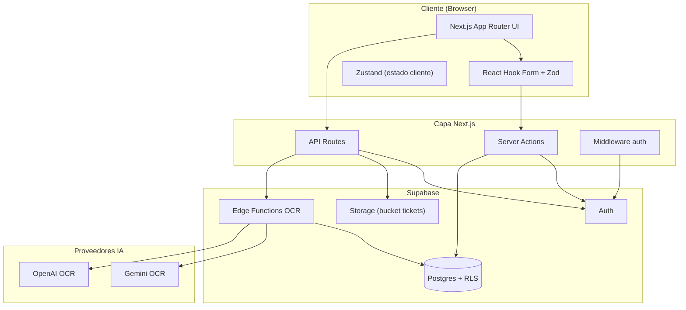
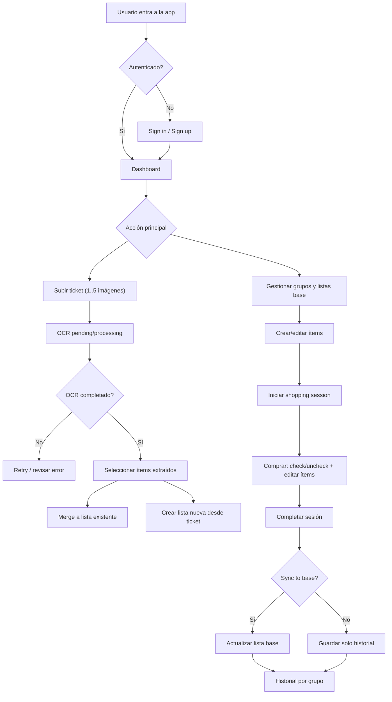
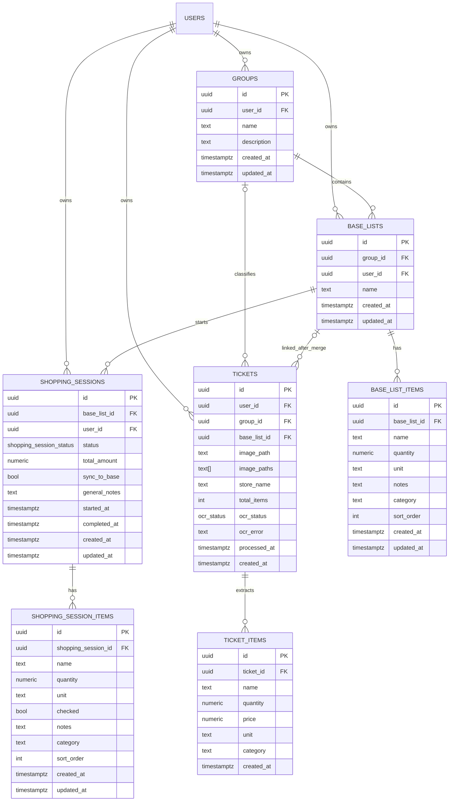

# PRD v1 — Listys

**Fecha:** 2026-02-11

## 1. Product overview

Listys — gestión de compras y OCR de tickets: una aplicación SaaS que permite a usuarios convertir tickets de compra en listas estructuradas, gestionar plantillas de compra reutilizables y ejecutar sesiones de compra en tiempo real con seguimiento de gasto.

Este PRD define el alcance inicial (MVP), objetivos de negocio y criterios de éxito para lanzar una primera versión estable y usable por usuarios individuales.

## 2. Problem statement

Muchos consumidores pierden tiempo reescribiendo listas de compra o extrayendo manualmente información de tickets físicos. No existe una experiencia sencilla que conecte el flujo físico del ticket con listas digitales reutilizables y seguimiento de gasto por sesión.

Listys resuelve este problema automatizando la extracción (OCR) de tickets, permitiendo la revisión/edición rápida y sincronizando ítems a listas base que se pueden reutilizar en futuras compras.

## 3. Goals

- Entregar un MVP que permita subir tickets (1–5 imágenes), procesarlos con OCR y revisar/mergear resultados en una lista base.
- Permitir crear y editar listas base, iniciar una sesión de compra clonando una lista base y completar la sesión con opcional sincronización a la lista base.
- Mantener la seguridad: todo acceso a datos sensibles controlado por RLS y validado server-side.

## 4. Non-goals

- No cubrir integración con sistemas de punto de venta empresariales en el MVP.
- No ofrecer análisis avanzado de gasto (reportes históricos detallados) en la primera versión.
- No implementar multi-usuario colaboración en tiempo real (solo sesión por usuario en el MVP).

## 5. Users & Personas

1. Consumidor regular: compra semanalmente y quiere acelerar la creación de listas a partir de tickets.
2. Organizador doméstico: mantiene listas base por categoría y comparte mentalmente (uso individual del producto).
3. Usuario con múltiples tickets: desea historial y búsqueda de ítems de tickets anteriores para ahorrar tiempo.

## 6. User journeys

1. Subir ticket → Procesamiento OCR → Revisar ítems extraídos → Crear lista nueva o mergear a lista existente.

	- Paso 1: Usuario selecciona 1–5 imágenes y envía `POST /api/upload-ticket`.
	- Paso 2: API valida archivos, sube imágenes y crea `ticket` con `ocr_status = pending`.
	- Paso 3: Edge Function procesa imágenes y crea `ticket_items` (estado `processing`).
	- Paso 4: OCR completa (`completed`) y usuario recibe notificación; puede revisar/editar ítems.
	- Paso 5: Usuario elige "Crear lista" o "Mergear a lista existente"; el sistema aplica upsert en `base_list_items`.

	- Acceptance criteria (ACE): El usuario puede completar el flujo end-to-end: upload acepta archivos válidos; OCR crea al menos un `ticket_item`; la acción "Merge" actualiza correctamente la lista objetivo y la UI muestra confirmación.

2. Crear lista base → Editar ítems → Iniciar sesión de compra desde lista base → Marcar ítems y completar sesión → Guardar historial.

	- Paso 1: Usuario crea `base_list` con nombre y grupo.
	- Paso 2: Usuario añade hasta `MAX_ITEMS_PER_BASE_LIST` ítems (250) con `sort_order`.
	- Paso 3: Usuario inicia `shopping_session` que clona `base_list_items` a `shopping_session_items`.
	- Paso 4: Durante la sesión el usuario puede check/uncheck, editar cantidades y notas.
	- Paso 5: Al completar, si `sync_to_base` está activo, los cambios se aplican a `base_list_items` dentro de una transacción.

	- ACE: La sesión crea correctamente `shopping_session` y `shopping_session_items`; completar actualiza estado a `completed` y, si se solicita, sincroniza cambios a la lista base sin duplicados.

3. Ver historial → Abrir sesión completada → Reutilizar como base para nueva lista.

	- Paso 1: Usuario abre `shopping-history` y filtra por grupo/fecha.
	- Paso 2: Usuario selecciona una sesión completada y elige "Crear lista desde sesión".
	- Paso 3: Sistema crea nueva `base_list` poblada con los `shopping_session_items` seleccionados.

	- ACE: Nueva `base_list` creada con ítems esperados y metadatos de origen (fecha, sessionId).

(Estos flujos fueron inferidos del código del repositorio y pueden ajustarse — marcados como [Assumed].)

## 7. Functional requirements

Transformamos los requisitos funcionales en historias de usuario con criterios de aceptación (ACE):

- Historia: "Como usuario quiero subir fotos de un ticket para obtener ítems ya extraídos".
	- ACE: `POST /api/upload-ticket` acepta 1–5 imágenes válidas; responde 202 (accept) o 201 con ticketId; el ticket queda en BD con `ocr_status = pending`.

- Historia: "Como sistema quiero procesar tickets en background para insertar `ticket_items`".
	- ACE: Edge Function pone `ocr_status = processing` al comenzar y `completed`/`failed` al finalizar; `ticket_items` se insertan sin duplicados inter-imagen.

- Historia: "Como usuario quiero crear/editar listas base y sus ítems".
	- ACE: CRUD opera con validaciones; no se permiten >250 ítems; nombres duplicados dentro de un grupo rechazados con 409.

- Historia: "Como usuario quiero iniciar una sesión de compra desde una lista base".
	- ACE: Crear `shopping_session` clona los ítems; la UI muestra progreso y la API permite marcar ítems; completar cambia estado a `completed` y registra `total_amount`.

- Historia: "Como usuario quiero mergear ítems OCR a una lista existente".
	- ACE: Merge upserta ítems por nombre/normalized_name; retorna resumen (nueva_count, updated_count, skipped_count).

## 8. Non-functional requirements

SLOs, Observabilidad y Operaciones (detalladas):

- SLO (API upload): 99.9% de requests `POST /api/upload-ticket` deben responder en <2s (p90 < 800ms) bajo carga normal.
- SLO (OCR completion): 95% de los tickets pequeños (≤2 imágenes, baja complejidad) deben alcanzar `completed` en <120s.
- Availability: Servicio web (Next.js) objetivo 99.9% uptime; Edge Functions y Supabase dependencias documentadas.

- Observability:
	- Instrumentar métricas: `tickets_uploaded_total`, `ocr_jobs_started`, `ocr_jobs_completed`, `ocr_jobs_failed`, `merge_operations_total`.
	- Logs estructurados incluyendo `ticketId`, `userId`, `edgeFunctionInstance`, y timings.
	- Tracing opcional: propagar `traceId` en pipeline OCR para correlación.

- Operational criteria:
	- Reintentos exponenciales para fallos transitorios de OCR (max 3 attempts).
	- Dead-letter queue o registro para tickets que fallen repetidamente, con `ocr_error` detallado.

## 9. Success metrics (KPIs)

KPIs con criterios de aceptación (medibles):

- KPI: Latencia OCR (p90): objetivo < 120s para tickets ≤2 imágenes. ACE: instrumentar `ocr_jobs_completed` con duración y reportar p50/p90/p99.
- KPI: Retención 7d: ≥ 25%. ACE: definir "usuario activo" (login + acción de completar sesión) y reportar cohort retention.
- KPI: OCR conversion rate: ≥ 60% ACE: medir porcentaje de tickets donde usuario acepta ≥3 ítems sin edición en 24h post-completion.
- KPI: Merge success rate: ≥ 98% ACE: operaciones de merge que produzcan upsert sin error; contar `merge_failures`.

## 10. Constraints

- Dependencia de proveedores de IA (Gemini/OpenAI) para OCR; latencia y coste variables.
- Límite de almacenamiento por imagen (10MB) y máxima 5 imágenes por ticket.
- RLS y políticas de Supabase deben cubrir todos los endpoints mutativos.

## 11. Key risks & mitigations

- OCR produce resultados pobres → Mitigación: mostrar UI de revisión y permitir reintentos manuales; registro de `ocr_error` para observabilidad.
- Costes de IA elevados → Mitigación: batch processing, límites y cuotas por usuario, caché de resultados comunes.
- Pérdida de datos al migrar listas → Mitigación: transacciones y constraints, backups periódicos.

## 12. Roadmap (phases)

- Phase 0 (Internal): Harden migrations, RLS, config limits, runbooks.
- Phase 1 (MVP 3 months): Ticket upload + OCR, lists base CRUD, shopping session, basic UI polish.
- Phase 2 (3–6 months): Improve OCR accuracy, multi-image merge, better UX flows, analytics basic.

## 13. Assumptions

- [Assumed] Target is individual consumers using mobile phones to take pictures of receipts.
- [Assumed] Authentication via Supabase Auth (email + OAuth) is sufficient for MVP.
- [Assumed] No enterprise integrations required for initial launch.

---

_Generado automáticamente a partir del repositorio. Marcar cualquier punto que quieras ajustar._

## 14. Diagrams (from repo)

Below are key diagrams extracted from the repository documentation to aid technical discussions and onboarding. They are included verbatim from `docs/README.md` and can be referenced in architecture conversations.

### Architecture (Mermaid)

### High-level user flow (Mermaid)

### Data model (ERD)

## 15. Marketing / Metadata (from `src/app/(marketing)/page.tsx`)

Include the marketing metadata used by the app for landing page SEO and OG previews. Useful for copywriters and marketing QA.

- Title: "Listys - Smart Shopping List Manager"
- Short description: "Manage your shopping lists with AI-powered receipt processing. Transform photos into organized lists instantly."
- Tagline / one-liner: "Transform receipts into organized shopping lists with AI. Save time and track spending."
- Keywords: shopping list, grocery app, AI receipt scanner, meal planning, expense tracker, smart shopping
- OpenGraph image: `/og-image.jpg` (1200x630)
- Site URL (metadataBase): https://listys.app
- Twitter creator: @listysapp

These fields are reflected in the landing page component metadata and should be used for marketing copy and OG testing.
