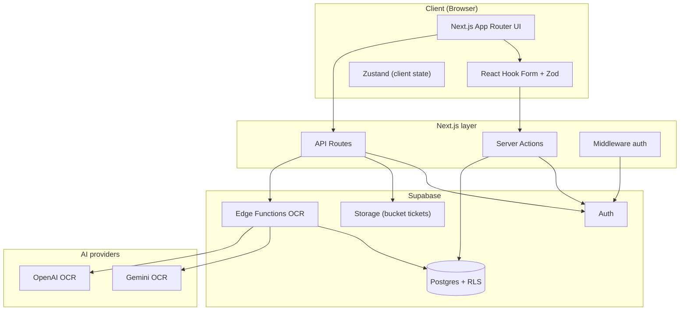
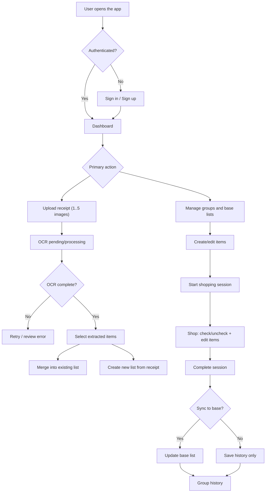
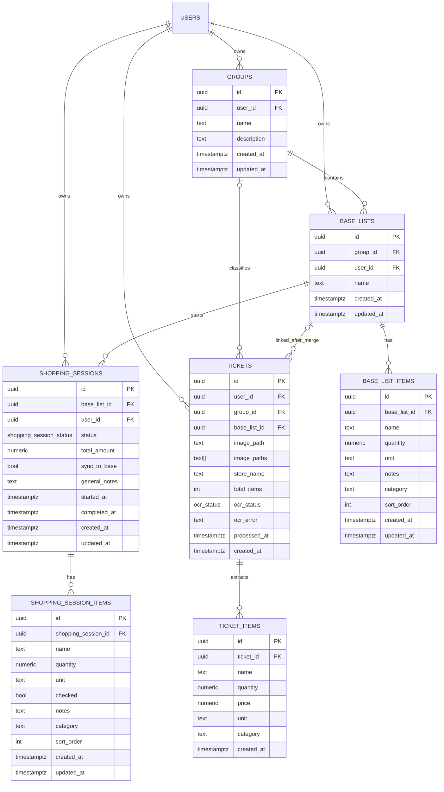

# PRD v1 — Listys

**Fecha:** 2026-02-11

## 1. Product overview

Listys — shopping management and receipt OCR: a SaaS application that lets users convert purchase receipts into structured lists, manage reusable shopping templates, and run real-time shopping sessions with spending tracking.

This PRD defines the initial scope (MVP), business goals, and success criteria for launching a stable first version for individual users.

## 2. Problem statement

Many consumers waste time rewriting shopping lists or manually extracting information from physical receipts. There is no simple experience that connects the physical receipt workflow with reusable digital lists and per-session spending tracking.

Listys solves this problem by automating receipt extraction (OCR), enabling quick review and editing, and syncing items into base lists that can be reused for future shopping trips.

## 3. Goals

- Deliver an MVP that supports receipt uploads (1–5 images), OCR processing, and review/merge of results into a base list.
- Allow users to create and edit base lists, start a shopping session by cloning a base list, and complete the session with optional synchronization back to the base list.
- Maintain security: all access to sensitive data is controlled by RLS and validated server-side.

## 4. Non-goals

- Do not cover integration with enterprise point-of-sale systems in the MVP.
- Do not offer advanced spending analysis (detailed historical reports) in the first version.
- Do not implement real-time multi-user collaboration (one session per user in the MVP).

## 5. Users & Personas

1. Regular consumer: shops weekly and wants to speed up list creation from receipts.
2. Household organizer: maintains category-based base lists and uses the product individually.
3. User with multiple receipts: wants history and search across items from previous receipts to save time.

## 6. User journeys

1. Upload receipt → OCR processing → Review extracted items → Create a new list or merge into an existing list.
   - Step 1: The user selects 1–5 images and sends `POST /api/upload-ticket`.
   - Step 2: The API validates the files, uploads the images, and creates a `ticket` with `ocr_status = pending`.
   - Step 3: The Edge Function processes the images and creates `ticket_items` (`processing` status).
   - Step 4: OCR completes (`completed`) and the user receives a notification; they can review and edit items.
   - Step 5: The user chooses "Create list" or "Merge into existing list"; the system upserts into `base_list_items`.

   - Acceptance criteria (ACE): The user can complete the end-to-end flow: upload accepts valid files; OCR creates at least one `ticket_item`; the "Merge" action updates the target list correctly and the UI shows confirmation.

2. Create a base list → Edit items → Start a shopping session from the base list → Mark items and complete the session → Save history.
   - Step 1: The user creates a `base_list` with a name and group.
   - Step 2: The user adds up to `MAX_ITEMS_PER_BASE_LIST` items (250) with `sort_order`.
   - Step 3: The user starts a `shopping_session` that clones `base_list_items` into `shopping_session_items`.
   - Step 4: During the session, the user can check/uncheck items and edit quantities and notes.
   - Step 5: On completion, if `sync_to_base` is enabled, changes are applied to `base_list_items` in a transaction.

   - ACE: The session correctly creates `shopping_session` and `shopping_session_items`; completion sets the status to `completed` and, when requested, synchronizes changes to the base list without duplicates.

3. View history → Open a completed session → Reuse it as the basis for a new list.
   - Step 1: The user opens `shopping-history` and filters by group/date.
   - Step 2: The user selects a completed session and chooses "Create list from session".
   - Step 3: The system creates a new `base_list` populated with the selected `shopping_session_items`.

   - ACE: A new `base_list` is created with the expected items and source metadata (date, sessionId).

These flows were inferred from the repository code and may change; they are marked as [Assumed].

## 7. Functional requirements

The functional requirements are expressed as user stories with acceptance criteria (ACE):

- Story: "As a user, I want to upload receipt photos so I can get extracted items."
  - ACE: `POST /api/upload-ticket` accepts 1–5 valid images; returns 202 (accepted) or 201 with ticketId; the ticket remains in the database with `ocr_status = pending`.

- Story: "As a system, I want to process receipts in the background so I can insert `ticket_items`."
  - ACE: The Edge Function sets `ocr_status = processing` when it starts and `completed`/`failed` when it finishes; `ticket_items` are inserted without cross-image duplicates.

- Story: "As a user, I want to create and edit base lists and their items."
  - ACE: CRUD operates with validation; more than 250 items are not allowed; duplicate names within a group are rejected with 409.

- Story: "As a user, I want to start a shopping session from a base list."
  - ACE: Creating a `shopping_session` clones the items; the UI shows progress and the API allows items to be marked; completion sets the status to `completed` and records `total_amount`.

- Story: "As a user, I want to merge OCR items into an existing list."
  - ACE: Merge upserts items by name/normalized_name and returns a summary (new_count, updated_count, skipped_count).

## 8. Non-functional requirements

Detailed SLOs, observability, and operations:

- SLO (upload API): 99.9% of `POST /api/upload-ticket` requests must respond in <2s (p90 < 800ms) under normal load.
- SLO (OCR completion): 95% of small receipts (≤2 images, low complexity) must reach `completed` in <120s.
- Availability: Target 99.9% uptime for the web service (Next.js); Edge Functions and Supabase dependencies are documented.

- Observability:
  - Instrument metrics: `tickets_uploaded_total`, `ocr_jobs_started`, `ocr_jobs_completed`, `ocr_jobs_failed`, `merge_operations_total`.
  - Structured logs including `ticketId`, `userId`, `edgeFunctionInstance`, and timings.
  - Optional tracing: propagate `traceId` through the OCR pipeline for correlation.

- Operational criteria:
  - Exponential retries for transient OCR failures (max 3 attempts).
  - Dead-letter queue or record for repeatedly failed receipts, with detailed `ocr_error`.

## 9. Success metrics (KPIs)

KPIs with measurable acceptance criteria:

- KPI: OCR latency (p90): target < 120s for receipts with ≤2 images. ACE: instrument `ocr_jobs_completed` with duration and report p50/p90/p99.
- KPI: 7-day retention: ≥ 25%. ACE: define "active user" (login + completed-session action) and report cohort retention.
- KPI: OCR conversion rate: ≥ 60%. ACE: measure the percentage of receipts where the user accepts ≥3 items without editing within 24 hours after completion.
- KPI: Merge success rate: ≥ 98%. ACE: count merge operations that produce an error-free upsert; track `merge_failures`.

## 10. Constraints

- Dependency on AI providers (Gemini/OpenAI) for OCR; latency and cost vary.
- Image storage limit of 10MB and a maximum of 5 images per receipt.
- Supabase RLS and policies must cover all mutating endpoints.

## 11. Key risks & mitigations

- Poor OCR results → Mitigation: provide a review UI and manual retries; record `ocr_error` for observability.
- High AI costs → Mitigation: batch processing, per-user limits and quotas, and caching of common results.
- Data loss during list migrations → Mitigation: transactions, constraints, and regular backups.

## 12. Roadmap (phases)

- Phase 0 (Internal): Harden migrations, RLS, config limits, runbooks.
- Phase 1 (MVP 3 months): Receipt upload + OCR, base-list CRUD, shopping sessions, and basic UI polish.
- Phase 2 (3–6 months): Improve OCR accuracy, multi-image merge, better UX flows, and basic analytics.

## 13. Assumptions

- [Assumed] Target is individual consumers using mobile phones to take pictures of receipts.
- [Assumed] Authentication via Supabase Auth (email + OAuth) is sufficient for MVP.
- [Assumed] No enterprise integrations required for initial launch.

---

_Generated automatically from the repository. Mark any item that needs adjustment._

## 14. Diagrams (from repo)

Below are key diagrams extracted from the repository documentation to aid technical discussions and onboarding. They are included verbatim from `docs/README.md` and can be referenced in architecture conversations.

### Architecture (Mermaid)

```mermaid
flowchart TB
		 subgraph Client["Client (Browser)"]
				UI["Next.js App Router UI"]
				Forms["React Hook Form + Zod"]
				State["Zustand (client state)"]
		end

		 subgraph Server["Next.js layer"]
				SA["Server Actions"]
				API["API Routes"]
				MW["Middleware auth"]
		end

		subgraph Supabase["Supabase"]
				Auth["Auth"]
				DB[("Postgres + RLS")]
				Storage["Storage (bucket tickets)"]
				Edge["Edge Functions OCR"]
		end

		 subgraph AI["AI providers"]
				Gemini["Gemini OCR"]
				OpenAI["OpenAI OCR"]
		end

		UI --> Forms
		Forms --> SA
		UI --> API
		MW --> Auth
		SA --> Auth
		SA --> DB
		API --> Auth
		API --> Storage
		API --> Edge
		Edge --> DB
		Edge --> Gemini
		Edge --> OpenAI
```

### High-level user flow (Mermaid)

```mermaid
flowchart TD
		 A["User opens the app"] --> B{"Authenticated?"}
		B -->|No| C["Sign in / Sign up"]
		 B -->|Yes| D["Dashboard"]
		C --> D

		 D --> E{"Primary action"}

		 E --> F["Manage groups and base lists"]
		 F --> G["Create/edit items"]
		 G --> H["Start shopping session"]

		 E --> I["Upload receipt (1..5 images)"]
		I --> J["OCR pending/processing"]
		 J --> K{"OCR complete?"}
		 K -->|No| L["Retry / review error"]
		 K -->|Yes| M["Select extracted items"]
		 M --> N["Merge into existing list"]
		 M --> O["Create new list from receipt"]

		 H --> P["Shop: check/uncheck + edit items"]
		 P --> Q["Complete session"]
		Q --> R{"Sync to base?"}
		 R -->|Yes| S["Update base list"]
		 R -->|No| T["Save history only"]
		 S --> U["Group history"]
		T --> U
```

### Data model (ERD)

```mermaid
erDiagram
		USERS ||--o{ GROUPS : owns
		USERS ||--o{ BASE_LISTS : owns
		USERS ||--o{ SHOPPING_SESSIONS : owns
		USERS ||--o{ TICKETS : owns

		GROUPS ||--o{ BASE_LISTS : contains
		BASE_LISTS ||--o{ BASE_LIST_ITEMS : has
		BASE_LISTS ||--o{ SHOPPING_SESSIONS : starts

		SHOPPING_SESSIONS ||--o{ SHOPPING_SESSION_ITEMS : has

		GROUPS o|--o{ TICKETS : classifies
		BASE_LISTS o|--o{ TICKETS : linked_after_merge
		TICKETS ||--o{ TICKET_ITEMS : extracts

		GROUPS {
			uuid id PK
			uuid user_id FK
			text name
			text description
			timestamptz created_at
			timestamptz updated_at
		}

		BASE_LISTS {
			uuid id PK
			uuid group_id FK
			uuid user_id FK
			text name
			timestamptz created_at
			timestamptz updated_at
		}

		BASE_LIST_ITEMS {
			uuid id PK
			uuid base_list_id FK
			text name
			numeric quantity
			text unit
			text notes
			text category
			int sort_order
			timestamptz created_at
			timestamptz updated_at
		}

		SHOPPING_SESSIONS {
			uuid id PK
			uuid base_list_id FK
			uuid user_id FK
			shopping_session_status status
			numeric total_amount
			bool sync_to_base
			text general_notes
			timestamptz started_at
			timestamptz completed_at
			timestamptz created_at
			timestamptz updated_at
		}

		SHOPPING_SESSION_ITEMS {
			uuid id PK
			uuid shopping_session_id FK
			text name
			numeric quantity
			text unit
			bool checked
			text notes
			text category
			int sort_order
			timestamptz created_at
			timestamptz updated_at
		}

		TICKETS {
			uuid id PK
			uuid user_id FK
			uuid group_id FK
			uuid base_list_id FK
			text image_path
			text[] image_paths
			text store_name
			int total_items
			ocr_status ocr_status
			text ocr_error
			timestamptz processed_at
			timestamptz created_at
		}

		TICKET_ITEMS {
			uuid id PK
			uuid ticket_id FK
			text name
			numeric quantity
			numeric price
			text unit
			text category
			timestamptz created_at
		}
```

## 15. Marketing / Metadata (from `src/app/(marketing)/page.tsx`)

Include the marketing metadata used by the app for landing page SEO and OG previews. Useful for copywriters and marketing QA.

- Title: "Listys - Smart Shopping List Manager"
- Short description: "Manage your shopping lists with AI-powered receipt processing. Transform photos into organized lists instantly."
- Tagline / one-liner: "Transform receipts into organized shopping lists with AI. Save time and track spending."
- Keywords: shopping list, grocery app, AI receipt scanner, meal planning, expense tracker, smart shopping
- OpenGraph image: `/og-image.jpg` (1200x630)
- Site URL (metadataBase): https://listys.app
- Twitter creator: @listysapp

These fields are reflected in the landing page component metadata and should be used for marketing copy and OG testing.
