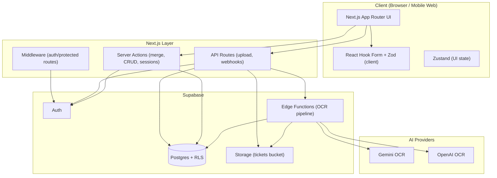
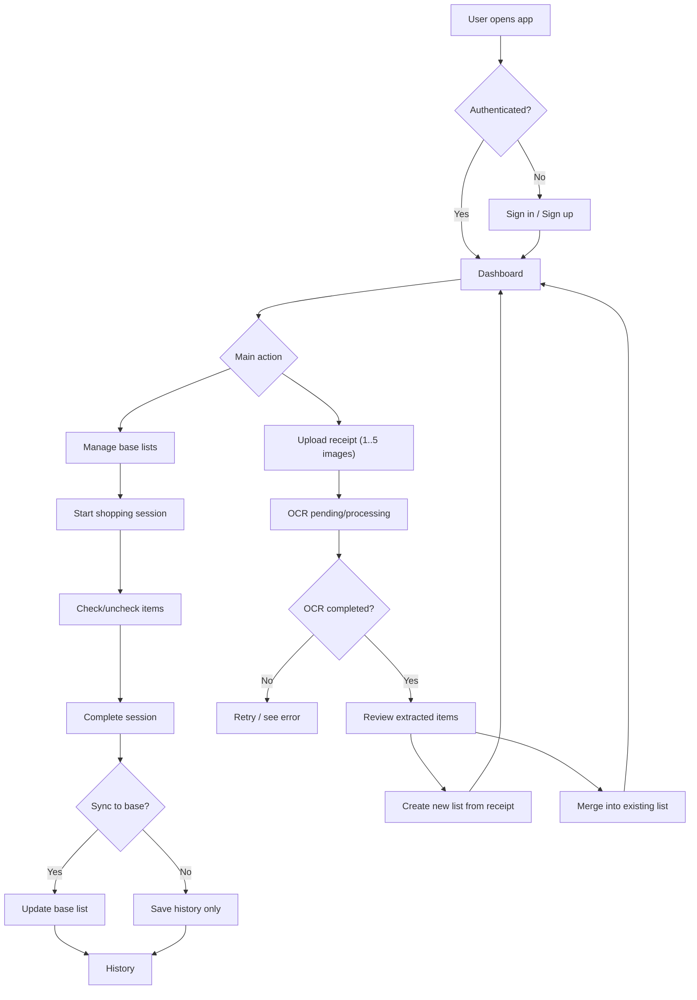
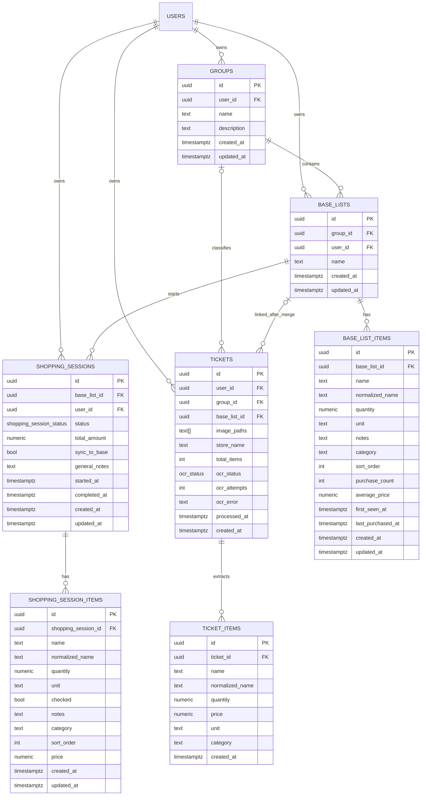

# Listys — Product Requirements Document (MVP v2)

## Platform Vision: Self‑Evolving Household Intelligence

**Status:** Implementation‑ready PRD (MVP v2)  
**Scope:** Single‑user (per account), mobile-first receipt capture, Supabase-first architecture.

---

## 1. Product Overview

Listys is a **household intelligence platform** that learns how users shop and automatically improves their **base shopping lists** over time.

In the MVP, receipts are **signals**, not the product. The product is an evolving system of lists that becomes more useful with every purchase.

**MVP includes:**

- Receipt upload (1–5 images) → OCR extraction
- Review/edit extracted items
- Merge into base lists (create new list or merge into existing)
- Automatic enrichment per base item (frequency, recency, average price)
- Shopping sessions cloned from base lists with **dynamic ordering**
- Optional sync back to base list on session completion

---

## 2. Problem Statement

Most consumers waste time recreating shopping lists and manually extracting items from physical receipts. Existing list apps are static: they don’t learn habits or improve future shopping experiences.

Listys solves this by:

1. converting receipt data into structured items,
2. merging them into reusable base lists, and
3. enriching items over time so future sessions are faster and more “naturally ordered”.

---

## 3. MVP Strategic Goals

Deliver a stable product that:

1. Lets users upload receipts and get extracted items (OCR).
2. Lets users merge those items into base lists (reusable).
3. Automatically enriches base items with behavioral memory (no extra user work).
4. Makes shopping sessions faster via dynamic ordering.

**Design constraint:** Intelligence is _invisible_ and _frictionless_ (target persona: average consumer).

---

## 4. Non‑Goals (MVP)

- No predictive restock alerts/notifications.
- No advanced analytics dashboards.
- No real‑time multi‑user collaboration.
- No enterprise POS integrations.
- No heavy ML models or training pipelines.

---

## 5. Target User & Persona

**Persona:** Average consumer who wants to save time.

**Needs:**

- “I want my list to build itself from receipts.”
- “Next time, show what I usually buy first.”
- “I don’t want to configure anything.”

---

## 6. Core Product Principle: Evolving Base Lists

A base list item accumulates **structured household memory**.

**Minimum enrichment fields for MVP:**

- `purchase_count` (frequency)
- `first_seen_at` (when the system first learned it)
- `last_purchased_at` (recency)
- `average_price` (simple economic memory)
- `normalized_name` (deterministic merging / de-dupe key)

This turns lists from static CRUD into adaptive objects.

---

## 7. User Journeys

### A) Receipt Upload → OCR → Review → Merge (Evolves Base List)

1. User selects **1–5 images** and calls `POST /api/upload-ticket`.
2. API validates, uploads to Storage, inserts `tickets` row with `ocr_status = pending`.
3. Edge Function starts OCR → sets `processing` → inserts `ticket_items`.
4. Edge Function completes → sets `completed` or `failed` + `ocr_error`.
5. User reviews/edits extracted items.
6. User chooses:
   - **Create new base list** from ticket items, or
   - **Merge into existing base list**.
7. Merge performs **upsert + enrichment** on `base_list_items`.

**Acceptance Criteria**

- End-to-end works for valid images: ticket created, at least one `ticket_item` generated.
- Merge updates target list and UI shows a summary.
- Merge is transactional and prevents duplicates via `normalized_name`.

---

### B) Start Shopping Session (Feels Smarter Without Explaining It)

1. User starts a `shopping_session` from a `base_list`.
2. System clones items to `shopping_session_items`.
3. Items are ordered by:
   1. `purchase_count DESC`
   2. `last_purchased_at DESC`
   3. `sort_order ASC` (tie-breaker)

**Acceptance Criteria**

- Session created and items cloned.
- Ordering matches rules above.
- Completing session sets status to `completed` and stores `total_amount` (if available).
- If `sync_to_base` is true, changes apply back to base list in a transaction.

---

### C) History → Reuse as New Base List

1. User opens history and selects a completed session.
2. User clicks “Create list from session”.
3. System creates a new base list populated from session items.

**Acceptance Criteria**

- Base list created with expected items.
- Stores provenance metadata (origin session id and created_at).

---

## 8. Functional Requirements (Stories + ACE)

### FR‑1: Receipt Upload

**Story:** As a user, I want to upload receipt photos so I can get extracted items.  
**ACE:**

- `POST /api/upload-ticket` accepts 1–5 images, max 10MB each.
- Returns `202` (accepted) with `ticketId` (or `201` if synchronous insert is preferred).
- `tickets.ocr_status = pending` after API returns.

### FR‑2: OCR Processing (Async)

**Story:** As a system, I want to process receipts in the background and store `ticket_items`.  
**ACE:**

- Edge Function sets `ocr_status = processing` when starting.
- Sets `completed` or `failed` with `ocr_error`.
- Inserts `ticket_items` without inter-image duplicates.

### FR‑3: Merge Into Base List + Enrichment

**Story:** As a user, I want to merge extracted items into a base list so future shopping is faster.  
**ACE:**

- Normalize names deterministically (`normalized_name`).
- Upsert by `(base_list_id, normalized_name)`.
- If exists: increment `purchase_count`, set `last_purchased_at`, update `average_price` incrementally.
- If new: create row with initial enrichment fields.
- Returns summary: `new_count`, `updated_count`, `skipped_count`.

### FR‑4: Base Lists CRUD

**Story:** As a user, I want to create and manage base lists and items.  
**ACE:**

- CRUD works with validation.
- Max 250 items per list.
- Duplicate list names within a group rejected with `409` (case-insensitive).

### FR‑5: Shopping Session

**Story:** As a user, I want to shop using a session cloned from a base list.  
**ACE:**

- Creating session clones items and applies dynamic ordering.
- API supports check/uncheck and editing notes/quantity.
- Completing session updates status, timestamps, and optional sync to base list.

---

## 9. Non‑Functional Requirements

### SLOs

- **Upload API:** 99.9% of `POST /api/upload-ticket` responses in < 2s (p90 < 800ms).
- **OCR completion:** 95% of tickets ≤2 images complete in < 120s.

### Observability

**Metrics**

- `tickets_uploaded_total`
- `ocr_jobs_started`
- `ocr_jobs_completed`
- `ocr_jobs_failed`
- `merge_operations_total`
- `enriched_items_total`

**Structured logs** (must include):

- `ticketId`, `userId`, `timing_ms`, `edge_instance`, `attempt`

### Reliability

- Exponential retry for transient OCR failures (max 3).
- Persistent record for repeatedly failed tickets (`ocr_error`, attempt count).
- Idempotent merge (safe to retry).

### Security

- All user data access controlled by **Supabase RLS**.
- Mutations validated server-side (Zod).
- Sensitive operations run in Server Actions or API routes (never client-trust).

---

## 10. Success Metrics (KPIs)

**Primary KPI**

- Users complete a second shopping session faster than their first (time-to-complete improvement).

**Secondary**

- OCR completion p90 < 120s (≤2 images)
- 7‑day retention ≥ 25% (active = login + completes a session)
- Merge success rate ≥ 98% (no DB errors, transactional upsert)
- OCR conversion ≥ 60% (user accepts ≥3 items with minimal edits within 24h)

---

## 11. Constraints

- AI providers (Gemini/OpenAI) cost and latency variability.
- Image size limit: 10MB. Max 5 images per ticket.
- RLS policies must cover all tables and all mutative endpoints.

---

## 12. Risks & Mitigations

- **Poor OCR quality** → strong review/edit UI + manual retry + `ocr_error` logging.
- **High AI costs** → quotas per user + batching + limits + future tiering.
- **Merge duplicates / messy names** → deterministic normalization + indexed `normalized_name` + transactional upsert.
- **Concurrency issues** (multiple sessions/tabs) → transactions + clear “completed” semantics; optional optimistic locking later.

---

## 13. Roadmap

### Phase 1 — MVP (Implementation target)

- Upload receipt + OCR
- Review extracted items
- Merge into base lists (create/merge)
- Enrichment fields updated on merge
- Shopping session with dynamic ordering
- Basic history and “create list from session”

### Phase 2 — Household Intelligence (visible)

- Restock suggestions (“you usually buy this weekly”)
- Price anomaly detection
- Basic household insights
- More robust normalization (synonyms/categories) and store detection

---

# 14. Mermaid Diagrams

## 14.1 System Architecture (Supabase‑first)

---

## 14.2 High‑level User Flow

---

## 14.3 Data Model (ERD) — Updated for Enrichment

---

# 15. Implementation Readiness

## 15.1 Required Decisions (locked for MVP)

- **Normalization algorithm**: deterministic string normalization (lowercase, trim, remove accents, collapse whitespace, remove punctuation).
- **Merge key**: `(base_list_id, normalized_name)` unique.
- **Ordering in sessions**: purchase_count desc, last_purchased_at desc, sort_order asc.
- **Limits**: max 5 images, 10MB each; max 250 items per base list.
- **Server-side validation**: Zod on API routes / Server Actions.
- **Security**: RLS deny-by-default; all tables user-scoped.

## 15.2 DB Changes (Migration Plan)

- Add `normalized_name`, `purchase_count`, `first_seen_at`, `last_purchased_at`, `average_price` to `base_list_items`.
- Add `normalized_name` to `ticket_items` (and optionally session items).
- Add unique constraint + index.

## 15.3 Endpoint/Action Contract (Minimal)

- `POST /api/upload-ticket` → returns `{ ticketId }`
- `POST /api/tickets/:id/retry` (optional MVP) → requeue OCR
- `SA: mergeTicketItems({ ticketId, baseListId })` → returns `{ new_count, updated_count, skipped_count }`
- `SA: createBaseListFromTicket({ ticketId, groupId, name })`
- `SA: startShoppingSession({ baseListId, syncToBase })`
- `SA: completeShoppingSession({ sessionId })`
- `SA: createBaseListFromSession({ sessionId, groupId, name })`

## 15.4 RLS Coverage Checklist (Must be true)

- Users can only access rows where `user_id = auth.uid()` (directly or via join ownership).
- `base_list_items` access limited to lists owned by the user.
- `ticket_items` access limited to tickets owned by the user.
- `shopping_session_items` limited to sessions owned by the user.

## 15.5 QA Acceptance Checklist (MVP)

- Upload valid images → ticket created → OCR completes → items visible.
- Merge updates base list and enrichment fields update correctly.
- Start session clones items ordered by rules.
- Complete session works; optional sync updates base list without duplicates.
- History creates new base list successfully.
- RLS prevents cross-user access in all tables.
- Observability: metrics/logs include ticketId/userId and durations.
